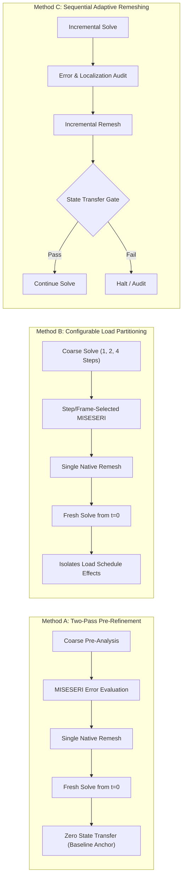

# Adaptive Remeshing Phase-Field Fracture Framework

> **Active AI Agents:** Codex and Gemini Antigravity only. Read `AGENTS.md` before inspecting, editing, running, committing, authorizing, or submitting anything. Protocol Version: 2.

Dynamic task, authorization, job, and session state is maintained strictly under `project_coordination/`.

This repository supports a Master's thesis developing and evaluating a **configurable Abaqus Python framework for adaptive mesh refinement in phase-field fracture simulations** using native Abaqus error estimation, user elements (UEL/UMAT), and state-transfer continuation.

---

## 1. Methodological Framework

The project investigates three distinct numerical methodologies for mesh refinement in phase-field fracture:

1. **Method A — Two-Pass Pre-Refinement (Authoritative Baseline):**
   - Direct reproduction of Pandey & Kumar (2025). Coarse pre-analysis $\to$ single $\text{MISESERI}$ error evaluation $\to$ single remesh $\to$ complete fracture analysis from $t=0$. Zero state transfer.
2. **Method B — Configurable Load Partitioning (Intermediate Study):**
   - Partitioning coarse loading into 1, 2, or 4 Abaqus steps $\to$ evaluate preliminary stress discretization error at intermediate or terminal states $\to$ single remesh $\to$ complete fracture analysis from $t=0$. Maximum increment size ($\Delta u_{\max}$) is strictly decoupled from the step count.
3. **Method C — Sequential Adaptive Remeshing (Gated Extension):**
   - Incremental loading $\to$ error/localization audit $\to$ remesh $\to$ state transfer ($u, d, \mathcal{H}, \text{STATEVs}$) $\to$ continuation. Strictly conditional on verified damage monotonicity ($d_{n+1} \ge d_n$), gradient fidelity ($\|\nabla d\|$), and global energy preservation.

---

## 2. Active Governance & Next Milestone

- **Next Supervisor Meeting:** **Thursday, 22 October 2026 — 10:00 AM** (Meeting of 08 October 2026 concluded).
- **Immediate Numerical Priority:** Mode-II adapted fracture solve (Job `1410807.mmaster02`, $22{,}530$ FEs, Miehe split, repaired indexing).
- **Mode-I Baseline Status:** Frozen for supervisor meeting (`v2026.10.08-supervisor-meeting-mode1-freeze`, UEL hash `CE8D5EDCD2911DCB018BB15275271F874E7EA62B8FB48CF4A8297469A83ACDD6`).
- **Parallel Architecture:** 1-CPU serial reference anchor; 8-thread shared-memory SMP qualified for production; 16-thread SMP unqualified; distributed multi-rank MPI strictly disqualified.

---

## 3. University Thesis / Report Master

The official university LaTeX package is the formatting master:

`MA_AdaptiveRemeshing_Report_2026/`

Key rules (see `AGENTS.md`):
- Preserve university `preambel.tex` and `abbrvnat_custom.bst` unchanged.
- Formal, evidence-based academic writing.
- Distinguish offline pre-refinement, state transfer, automated external-driver remeshing, and in-analysis remeshing.
- Total computational cost accounting: $T_{\text{total}} = T_{\text{solver}} + T_{\text{remeshing}} + T_{\text{state\_transfer}} + T_{\text{pre/post}}$.

---

## 4. Key Paths

| Path | Role |
| :--- | :--- |
| `AGENTS.md` | Mandatory Codex/Gemini Antigravity bootstrap, governance, and writing rules |
| `GEMINI.md` | Gemini Antigravity entrypoint |
| `project_coordination/` | Active session lock, task ledger, job ledger, artifact registry, session reports |
| `.agent.md` | Compatibility entrypoint & stable scientific rules |
| `THESIS_PLAN.md` | Complete thesis work package breakdown, numerical study matrix, and roadmap |
| `docs/decisions/` | Consolidated decision records (including `2026-10-08_supervisor_meeting.md`) |
| `docs/methods/` | Formal methodology and procedural specifications |
| `docs/project/PROJECT_PHASE_CHECKLIST.md` | Authoritative living phase checklist |
| `MA_AdaptiveRemeshing_Report_2026/` | Official university LaTeX thesis report build |
