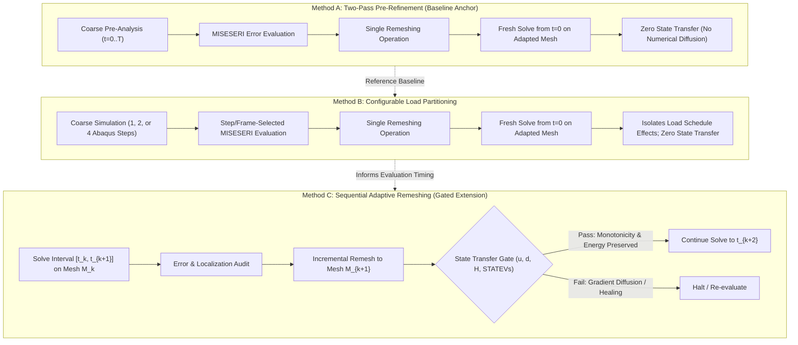

# Thesis Execution Plan

## Topic

**Application of Built-in Adaptive Remeshing and Mesh Refinement Features in Abaqus to Fracture Simulations Using Phase-field User Elements**

---

## 1. Primary Research & Implementation Goal

Develop and evaluate a **configurable Abaqus Python framework for adaptive mesh refinement in phase-field fracture simulations** using native Abaqus error estimation and remeshing.

The framework supports automated pre-refinement and investigates sequential refinement during crack propagation, without requiring the crack trajectory to be prescribed in advance.

Its effectiveness is assessed through:
1. **Scientific accuracy:** Correct force–displacement response, initial structural stiffness $K_0$, crack trajectory, damage localization, and global energy evolution.
2. **Computational efficiency:** Total runtime, memory usage, and refinement overhead across the full execution chain:
   $$T_{\text{total}} = T_{\text{solver}} + T_{\text{remeshing}} + T_{\text{state\_transfer}} + T_{\text{pre/post}}$$

---

## 2. The Three Investigated Numerical Methodologies

1. **Method A — Two-Pass Pre-Refinement (Pandey–Kumar Baseline):**
   - Coarse linear-elastic pre-analysis $\to$ single $\text{MISESERI}$ error evaluation $\to$ single remesh $\to$ complete phase-field fracture simulation from undamaged state ($t=0$).
   - Completely avoids state transfer, history interpolation, and gradient diffusion errors.
   - Frozen as the authoritative reference anchor.

2. **Method B — Configurable Load Partitioning (Intermediate Investigation):**
   - Coarse pre-analysis divided into 1, 2, or 4 Abaqus steps $\to$ error evaluation at intermediate or terminal states $\to$ single remesh $\to$ complete simulation from $t=0$.
   - Isolates the influence of loading schedules and evolving stress concentrations on mesh sizing, without introducing state-transfer errors.
   - Maximum increment size ($\Delta u_{\max}$) is strictly decoupled from the step count.

3. **Method C — Sequential Adaptive Remeshing (Separately Gated Thesis Contribution):**
   - Incremental loading $\to$ error/localization audit $\to$ remesh $\to$ state transfer $\to$ continuation.
   - Gated behind strict verification of damage monotonicity ($d_{n+1} \ge d_n$), gradient fidelity ($\|\nabla d_{\text{mapped}} - \nabla d_{\text{donor}}\|$), strain-history mapping ($\mathcal{H}$), and global energy preservation ($\Delta E_{\text{transfer}} \le \epsilon_{\text{energy}}$).

---

## 3. Work Packages

### WP0 — Environment, Repository Infrastructure & Source Governance
- Multi-agent coordination under `project_coordination/` (Protocol Version 2).
- Single-rank shared-memory SMP execution qualified (8-thread qualified, 16-thread unqualified, MPI strictly disqualified).
- Notification traps and guarded SSH command infrastructure.

### WP1 — One-Element & Constitutive Interface Verification
- Verification of UEL property array ABI, DOF ordering, and staggered integration.
- Analytical parity of elastic energy, phase-field degradation, and irreversibility.
- *Status: CLOSED_PASSED.*

### WP2 — Uniform-Mesh Reference Anchor (Mode-I)
- Single-edge-notched Mode-I tensile benchmark ($\Omega = 1\times 1\,\text{mm}, a_0 = 0.5\,\text{mm}, l_0 = 0.0075\,\text{mm}$).
- Reconstructed 15,192-element baseline (Job 1398090): $F_{\max} = 0.757778\,\text{kN}$, $u(F_{\max}) = 0.005857\,\text{mm}$, initial structural stiffness $K_0 = 137.945520\,\text{kN/mm}$.
- Non-invasive UEL energy formulation qualified (SDV17 $E_{\text{frac}}$, SDV18 $E_{\text{elas}}$, SDV19 $\bar{\psi}_f$, SDV20 $\bar{\psi}_e$, source hash `CE8D5EDC...`).
- *Status: CLOSED_PASSED.*

### WP3 — MISESERI Pre-Analysis & Method A Reproduction
- Verification of linear-elastic continuum stress recovery error indicator $\text{MISESERI}$.
- Automated CAE `RemeshingRule` and `adaptiveRemesh` workflow with 3-layer UEL/UMAT deck reconstruction.
- Documentation of tested sizing trends ($\text{errorTarget}=1.0 \to 71,320$ FEs, $2.0 \to 17,687$ FEs, $3.0 \to 8,120$ FEs, $5.0 \to 4,356$ FEs) under supervisor-accepted publication missing-information boundary.
- *Status: CLOSED_PASSED.*

### WP4 — Mode-II Fracture Reproduction & Frame Diagnosis (Gate M2-4)
- Verification of Mode-II shear benchmark ($\Omega = 1\times 1\,\text{mm}, a_0 = 0.5\,\text{mm}, l_0 = 0.015\,\text{mm}$).
- Execution of adapted fracture simulation (Job `1410807.mmaster02`, $22{,}530$ FEs, Miehe anisotropic split, repaired indexing).
- Audit of physical crack trajectory ($70.5^\circ$), reaction force evolution, and remeshing-frame sensitivity.
- *Status: ACTIVE / QUEUED.*

### WP5 — Configurable Load Partitioning Investigation (Method B)
- Investigation of 1-, 2-, and 4-step loading schedules on Mode-I benchmark with fixed equilibrium increment bounds ($\Delta u_{\max}$).
- Evaluation of stress concentration dynamics before vs after localization.
- Delivery of parameterized multi-step deck generator.
- *Status: NEXT PRIORITY.*

### WP6 — Sequential Adaptive Remeshing & State Transfer Gate (Method C)
- Mathematical and numerical formulation of state transfer for $u$, $d$, $\mathcal{H}$, and internal state variables.
- Verification of damage monotonicity ($d_{n+1} \ge d_n$), gradient fidelity ($\|\nabla d\|$), and global energy preservation.
- Execution of controlled incremental remeshing test.
- *Status: SEPARATELY GATED EXTENSION.*

### WP7 — Accuracy vs. Computational Cost Synthesis
- Systematic Pareto comparison across Methods A, B, and C:
  $$T_{\text{total}} = T_{\text{solver}} + T_{\text{remeshing}} + T_{\text{state\_transfer}} + T_{\text{pre/post}}$$
- Quantification of accuracy ($F(u)$ curve error, peak error, crack path error, energy balance) versus total computational resource investment.
- Practical sizing and parameter recommendations for engineering applications.

### WP8 — Authentic IMFD/ABAQUSER Integration (Proposal Task 6)
- Integration of authentic IMFD ABAQUSER toolchain for phase-field and mechanical field post-processing.
- Numerical verification of ABAQUSER outputs against independent ODB extractions.
- *Status: ON HOLD (scheduled after numerical fundamentals are qualified).*

### WP9 — General Applicability Demonstrator
- Demonstration of adaptive framework on an asymmetric geometry with a curved crack path (e.g. notched plate with hole) to verify generality.
- *Status: CONDITIONAL / ADVANCED STAGE.*

### WP10 — University Master's Thesis Synthesis
- Authoritative university LaTeX report build: `MA_AdaptiveRemeshing_Report_2026/`.
- Clear epistemic separation: Theory $\to$ Numerical Evidence $\to$ Unresolved Questions.
- Deliverables updated continuously for bi-weekly supervisor milestones.

---

## 4. Initial Numerical Study Matrix

| Case ID | Method | Abaqus Steps | Remesh Events | State Transfer | Scientific Purpose |
| :--- | :---: | :---: | :---: | :---: | :--- |
| **M1-P1** | Method A | 1 Step ($10\,\mu\text{m}$) | 1 (Terminal) | None | Single-step, two-pass baseline reference |
| **M1-P2** | Method B | 2 Steps ($5 + 5\,\mu\text{m}$) | 1 (Interm./Term.) | None | Examine step splitting and localization capture |
| **M1-P4** | Method B | 4 Steps ($2.5\,\mu\text{m}\times 4$) | 1 (Selected Step) | None | Finer load partitioning study |
| **M1-I2** | Method C | 2 Intervals | 2 Events | **Mandatory** | Sequential remeshing pilot (Gated) |
| **M1-I4** | Method C | 4 Intervals | Up to 4 Events | **Mandatory** | Multi-stage sequential refinement study (Gated) |

---

## 5. Critical Thesis Distinctions

- **$\text{MISESERI}$ vs. Phase-Field Error:** $\text{MISESERI}$ is a linear-elastic recovered stress error indicator, not a phase-field damage estimator.
- **Offline Pre-Refinement vs. Sequential Remeshing:** Pre-refinement solves the full history from $t=0$ on a fixed adapted mesh; sequential remeshing transfers evolving internal state during crack propagation.
- **Loading Steps vs. Equilibrium Increments:** Dividing an Abaqus step into multiple steps is distinct from controlling the equilibrium time-increment resolution ($\Delta u_{\max}$).
- **Technical Solver Pass vs. Scientific Validation:** A solver exit code of 0 is technical completion; scientific validation strictly requires multi-quantity error bounds ($F(u), K_0, d(x), E_{\text{total}}, T_{\text{total}}$).
