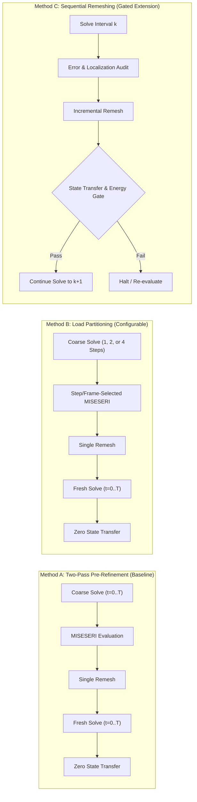

# Decision Record: 08 October 2026 Supervisor Meeting & Strategic Thesis Alignment

**Date:** 2026-10-08  
**Protocol Version:** 2  
**Status:** APPROVED_AND_RECORDED  
**Author:** Codex & Gemini Antigravity  
**Context:** Supervisor progress meeting of Thursday, 08 October 2026 (10:00 CEST); preparation for next meeting on Thursday, 22 October 2026 (10:00 AM).

---

## 1. Executive Summary & Context

Following the supervisor meeting of 08 October 2026, the overarching thesis goal progresses from purely reproducing the two-pass Pandey–Kumar adaptive remeshing workflow toward establishing a **configurable, robust, and computationally efficient adaptive refinement framework** in Abaqus for phase-field fracture simulations.

The governing directive remains:
> *"We need to have understood everything related to the first model before we increase complexity."*

Accordingly, the thesis will systematically investigate three distinct numerical methodologies while preserving the frozen Mode-I baseline and all established scientific invariants.

---

## 2. Five Core Supervisor Objectives

| Priority | Supervisor Objective | Thesis Response & Execution Plan |
| :---: | :--- | :--- |
| **1** | **Verify methodology on Mode-II fracture** | Complete and validate Mode-II reproduction via active PBS Job `1410807.mmaster02` (Miehe anisotropic split, $22{,}530$ FEs, repaired indexing), auditing crack path ($70.5^\circ$) and remeshing-frame sensitivity. |
| **2** | **Investigate load partitioning** | Compare 1-, 2-, and 4-step Abaqus loading schedules under fixed equilibrium increment limits ($\Delta u_{\max}$) on the validated Mode-I benchmark to isolate stress-evolution capture without introducing state-transfer errors. |
| **3** | **Investigate sequential remeshing during crack propagation** | Formulate and evaluate an incremental remeshing workflow (Method C) as a separately gated thesis contribution, strictly conditional on verified state transfer and damage irreversibility. |
| **4** | **Quantify accuracy and computational efficiency** | Perform controlled convergence and timing studies measuring total computational cost: $T_{\text{total}} = T_{\text{solver}} + T_{\text{remesh}} + T_{\text{transfer}} + T_{\text{pre/post}}$. |
| **5** | **Demonstrate general applicability** | Test the framework on a curved crack path influenced by an asymmetric feature (e.g. hole benchmark) once simpler benchmarks are thoroughly qualified. |

---

## 3. The Three Distinct Numerical Methodologies

### Method A — Two-Pass Pre-Refinement (Unchanged Reference Baseline)
- **Workflow:** Coarse pre-analysis $\to$ single MISESERI error evaluation $\to$ single `adaptiveRemesh` operation $\to$ fresh simulation from $t=0$ on the refined mesh.
- **State Transfer:** None required.
- **Governance:** Frozen as the authoritative reference baseline reproducing Pandey & Kumar (2025).

### Method B — Configurable Load Partitioning (Intermediate Investigation)
- **Workflow:** Divide coarse loading into 1, 2, or 4 Abaqus steps $\to$ evaluate preliminary stress discretization error at designated intermediate or terminal states $\to$ remesh once $\to$ fresh simulation from $t=0$ on the adapted mesh.
- **Purpose:** Investigate how loading schedules and transient crack-tip stress fields influence the resulting refinement corridor, completely decoupled from state-transfer interpolation errors.
- **Increment Control:** Maximum increment size ($\Delta u_{\max}$) is strictly decoupled from the number of Abaqus steps.

### Method C — Sequential Adaptive Remeshing (Separately Gated Extension)
- **Workflow:** Load incrementally $\to$ evaluate current error/localization field $\to$ remesh $\to$ map displacement, phase field, history, and integration-point variables across non-matching meshes $\to$ continue loading.
- **Strict Verification Gates:**
  1. **Damage Monotonicity:** $d_{n+1} \ge d_n$ must be strictly preserved; no spurious damage healing or artificial rupture.
  2. **Gradient Resolution:** Interpolation must not artificially diffuse $|\nabla d|$, which would distort crack surface energy.
  3. **History Variable Mapping:** $H(x, y)$ must be mapped accurately at integration points.
  4. **Energy Balance:** Global energy jump across mapping must remain within pre-declared tolerance.

---

## 4. Physical & Numerical Epistemology Corrections

1. **Displacement Scaling Clarification:**
   - Mode-I Step-1 displacement endpoint: $u_y = 0.005\,\text{mm} = 5\,\mu\text{m}$.
   - Mode-I Step-2 displacement endpoint: $u_y = 0.010\,\text{mm} = 10\,\mu\text{m}$.
   - *(Corrects typographical mentions of $0.5\,\mu\text{m}$ and $1.0\,\mu\text{m}$ in discussion summaries).*

2. **Terminology Disambiguation:**
   - **Total Loading Horizon:** Prescribed total displacement (e.g. $u_{\max} = 10\,\mu\text{m}$ in Mode-I, $20\,\mu\text{m}$ in Mode-II).
   - **Abaqus Analysis Steps:** Structural load stages within an input deck (1, 2, or 4 steps).
   - **Equilibrium Increments:** Discrete numerical increments evaluated by the solver within a step.
   - **Remeshing Events:** Explicit mesh modification/adaptation operations.

3. **Nature of MISESERI:**
   - $\text{MISESERI}$ is the Abaqus discretization error indicator for the recovered linear-elastic continuum stress field ($\mathbf{\sigma}_h$).
   - It is **not** phase-field damage error and **not** crack error. Its effectiveness relies on capturing stress concentrations prior to or during localization.

---

## 5. Scope Holds & Deliverables for 22 October 2026 Meeting

### Deliverables for Next Meeting (Thursday, 22 October 2026, 10:00 AM):
1. **Mode-II Benchmark Verification:** Evaluation of Job `1410807.mmaster02` ($22{,}530$ FEs), crack path angle ($70.5^\circ$), reaction force drop, and remeshing-frame sensitivity.
2. **Mode-I Load Partitioning Study (Method B):** Controlled comparison of 1-, 2-, and 4-step loading on force response, initial stiffness $K_0$, and runtime overhead.
3. **Sequential Remeshing & State Transfer Technical Specification:** Formal formulation of state mapping, irreversibility enforcement, and energy conservation criteria.
4. **Updated Methodology Documentation:** Formalization of the configurable adaptive framework in the thesis body.

### Scope Holds Preserved:
- Mode-I baseline tag `v2026.10.08-supervisor-meeting-mode1-freeze` and UEL hash `CE8D5EDC...` remain 100% frozen.
- Gate 7 (ABAQUSER integration) remains in thesis scope (Proposal Task 6) and will be integrated after numerical fundamentals are qualified.
- Complex multi-hole benchmarks remain held until simpler configurations are fully qualified.
