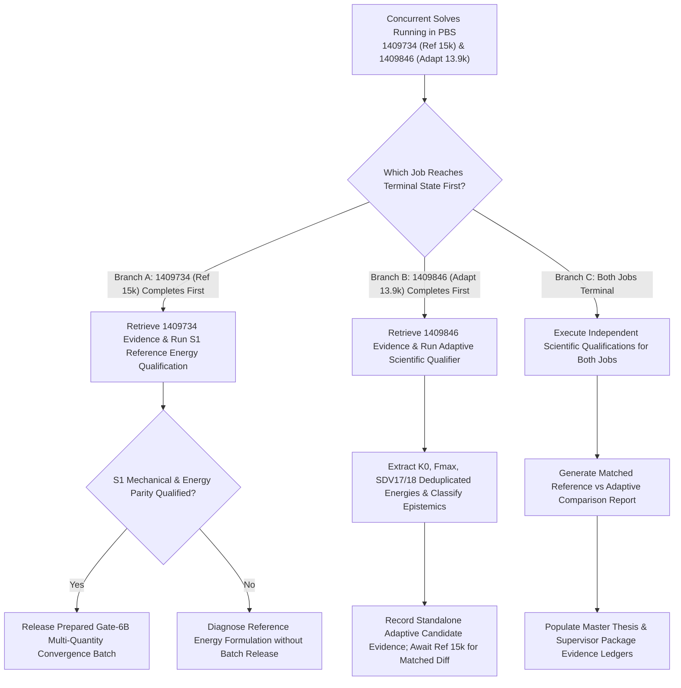

# Decision Record: Automatic Terminal Decision Tree for Concurrent Mode-I Benchmark Solves

**Phase**: `MODE1_GATE6B_ENERGY_CONVERGENCE_AND_STEP2_RECONCILIATION_ACTIVE`  
**Active Concurrent Solves**:
1. Job **`1409734.mmaster02`** (`PK_M1_REF15K_ENERGY`, 15,192 Finite Elements, Fixed Reference Anchor)
2. Job **`1409846.mmaster02`** (`PK_M1_ADAPT_2PCT_13K_ENERGY`, 13,897 Finite Elements, Efficiency-Calibrated Adaptive Candidate)

---

## 1. Governing Principle & Non-Polling Guard

While both solver jobs are active in PBS queue `normal_imfdfkmq`:
- Both solver jobs remain completely untouched and unpolled.
- Active `.odb`, `.lck`, `.sta`, `.msg`, `.dat`, `.log`, and energy CSV files are NOT inspected during execution.
- Telemetry and evidence collection is triggered strictly upon receipt of scheduler terminal notification or verified job completion.

---

## 2. Three-Branch Automatic Terminal Decision Logic

---

## 3. Branch Details & Actionable Protocols

### Branch A: Reference Job `1409734.mmaster02` Completes First
1. **Evidence Collection**: Retrieve lightweight scheduler logs (`stdout`, `stderr`), solver logs (`.dat`, `.msg`, `.sta`), and run `extract_authoritative_mode1_energy_complete.py`.
2. **S1 Parity Qualification**: Verify $K_0 = 137.95\,\text{kN/mm}$ ($\Delta \le 0.5\%$), $F_{\max} = 0.758\,\text{kN}$ ($\Delta \le 0.5\%$), SDV17/18 non-zero, deduplicated element energy, and descriptive bookkeeping residual.
3. **Downstream Action**: If S1 qualifies, release the prepared Gate-6B multi-quantity convergence batch (temporal and length-scale sensitivity series).

### Branch B: Adaptive Job `1409846.mmaster02` Completes First
1. **Evidence Collection**: Retrieve lightweight scheduler and solver logs, and run `extract_mode1_adaptive_13k_energy.py`.
2. **Adaptive Qualification**: Run `evaluate_mode1_adaptive_terminal_job.py` to evaluate mechanical response ($K_0$, $F_{\max}$, $W_{\text{ext}}$), deduplicated SDV17/18 energies, $d(x, y=0.5)$ ligament profile, and classify as efficiency-calibrated 2% variant.
3. **Downstream Action**: Record standalone adaptive evidence. Do *not* wait for 1409734 merely to characterize the adaptive result. Once 1409734 completes, automatically trigger matched comparison.

### Branch C: Both Jobs Complete Simultaneously
1. **Independent Evaluation**: Run S1 evaluator for 1409734 and adaptive evaluator for 1409846.
2. **Matched Comparison**: Populate `MODE1_REFERENCE_VS_ADAPTIVE_ENERGY_COMPARISON_TEMPLATE.md` to establish relative discretization cost vs accuracy trade-offs.
3. **Supervisor Deliverable**: Synchronize the 08-October-2026 supervisor presentation packet and master thesis draft.
