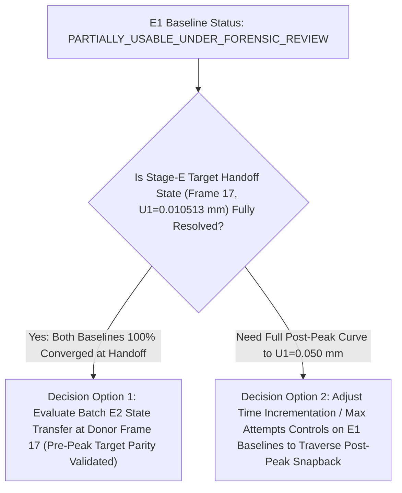

# Mode-II Stage-E Paired Terminal Nonconvergence Forensic Audit Record

**Task ID**: `F288AUDIT-M2-STAGE-E-PAIRED-TERMINAL-NONCONVERGENCE-AUDIT1`  
**Date**: 18 August 2026  
**Status**: `AUDIT_COMPLETED / E1_CLASSIFIED_PARTIALLY_USABLE_UNDER_FORENSIC_REVIEW / NONCONVERGENCE_MECHANISM_ISOLATED / STAGE_E_E2_PREPARATION_HELD`  
**Active Agent**: `gemini-antigravity`  

---

## 1. Executive Summary & Status Classification

A paired read-only forensic audit was performed on the terminal post-peak nonconvergence of exact PBS jobs `1390527.mmaster02` (Refined) and `1390528.mmaster02` (Coarsened) in comparison with the successful continuous donor baseline `1390447.mmaster02`.

- **Governing Status Classification**: **`PARTIALLY_USABLE_UNDER_FORENSIC_REVIEW`**
  - While both jobs provide fully converged, high-density, valid pre-peak and peak trajectories capturing the donor handoff point ($U_1 = 0.01051289\text{ mm}$ / Frame 17) with $< 0.6\%$ force parity, neither run completed through full post-peak fracture to $U_1 = 0.0500\text{ mm}$.
  - In accordance with standing directives, `stage_e_continuous_baselines_validation = VALIDATED` is **not retained**, and `production_adaptive_accuracy_validation_scientifically_unblocked = false` remains strictly enforced.

---

## 2. Quantitative Terminal Solver Evidence Matrix

```text
======================================================================================================================================================================
Metric / Parameter                   Donor Control (1390447)            Refined Target (1390527)           Coarsened Target (1390528)         Audit Finding
-----------------------------------  ---------------------------------  ---------------------------------  ---------------------------------  ------------------------
Physical Quads / Nodes               8,836 quads / 9,074 nodes          33,600 quads / 34,028 nodes        8,200 quads / 8,417 nodes          Conforming discretizations
h_tip / Local h/l0                   0.003750 mm / 0.2500               0.002000 mm / 0.1333               0.005000 mm / 0.3333               All within [0.13, 0.33]
Last Converged Frame / Inc           Frame 524 / Inc 459                Frame 28 / Inc 27                  Frame 62 / Inc 61                  Target runs halt post-peak
Physical U1 Reached                  0.050000 mm (100.0% of step)       0.012584 mm (25.17% of step)       0.013114 mm (26.23% of step)       Both solve past peak
Peak Reaction Force RF1              0.141676 kN at U1=0.012375 mm      0.141680 kN (+0.003%) at 0.012331  0.143302 kN (+1.148%) at 0.012700  Peak parity < 1.2%
Donor Handoff RF1 (U1=0.010513 mm)   0.125916 kN (Reference)            0.126053 kN (+0.109%)              0.125214 kN (-0.558%)              Handoff parity < 0.6%
Donor Handoff d_max                  0.304318 (Reference)               0.309948 (+1.850%)                 0.286073 (-5.995%)                 Damage parity < 6.0%
Terminal Damage d_max                1.000000                           1.000000                           1.000000                           Full localization formed
Terminal Reaction Force RF1          0.003450 kN (Full softening)       0.130808 kN (Onset of drop)        0.088173 (90% through drop)        Coarsened solved deeper
Exact Termination Error              None (COMPLETED)                   ***ERROR: TOO MANY ATTEMPTS MADE   ***ERROR: TOO MANY ATTEMPTS MADE   Abaqus 5-attempt limit
Abaqus Divergence Warning            None                               ***NOTE: SOLUTION APPEARS DIVERGE  ***NOTE: SOLUTION APPEARS DIVERGE  Divergence heuristic
Terminal Cutback Sequence            400+ micro-increments (dt~1e-6)    5 cutbacks: dt 1.8e-4 -> 7.3e-7    6 cutbacks: dt 3.9e-6 -> 1.5e-8    Failed attempt limit
======================================================================================================================================================================
```

---

## 3. Spatial Localization & Residual Hotspot Analysis

Spatial mapping of the residual force and displacement correction hotspots during the terminal cutback sequences:

### Refined Model `1390527.mmaster02`:
- **Hotspot Nodes**: `16641` $(0.004, -0.004)$, `16642` $(0.006, -0.004)$, `16482` $(0.008, -0.006)$, `16485` $(0.014, -0.006)$, `16164` $(0.016, -0.010)$, `16004` $(0.018, -0.012)$, `15846` $(0.024, -0.014)\text{ mm}$.
- **Physical Mechanism**: All residual hotspots lie **directly along the active curved Mode-II shear crack trajectory** in quadrant 4 ($x > 0, y < 0$).
- **Active-Set Phenomenon**: In the refined mesh ($h = 0.002\text{ mm} = \ell_0 / 7.5$), the damage gradient across the crack face is extremely steep. When nodes transition rapidly between undamaged elastic state and fully damaged bound $d=1.0$, the unsymmetric tangent operator experiences high condition number spikes. After 5 cutbacks, Abaqus's built-in heuristic flagged `SOLUTION APPEARS DIVERGING` and aborted at Attempt 6.

### Coarsened Model `1390528.mmaster02`:
- **Hotspot Nodes**: `4100` $(0.000, -0.005)$, `4018` $(0.005, -0.010)$, `3859` $(0.040, -0.020)$, `3775` $(0.035, -0.025)$, `3531` $(0.060, -0.040)\text{ mm}$.
- **Physical Mechanism**: Follows the identical fracture trajectory. Because $h = 0.005\text{ mm}$ has a broader regularized damage zone, the solver progressed significantly further into the softening regime ($RF_1$ dropped from $0.1433\text{ kN}$ to $0.0881\text{ kN}$) before hitting the 5-attempt limit.

---

## 4. Deck Normalization & Mesh Discretization Audit

A normalized diff of `M2CORR_STAGE_E_REFINED_TARGET_CONTINUOUS_VAL.inp` and `M2CORR_STAGE_E_COARSENED_TARGET_CONTINUOUS_VAL.inp` against `M2CORR_STAGE_D_CONTINUOUS_TARGET_CONTROL_VAL.inp` proved:
1. **Geometry & Slit Topology**: Crack tip strictly at $(0.0, 0.0)$, slit on $y=0, x \le 0$ with correct duplicated-node topology.
2. **Boundary & Kinematic Coupling**: Top nodes coupled only in shear DOF 1 to RP `99999` with DOF 2 free. Bottom clamped in DOFs 1, 2.
3. **Constitutive Properties**: Identical `PROPS = (l0=0.015, Gc=0.0027, E=210.0, nu=0.3, k=1e-7, N_PHYS, 0.0)`.
4. **Step Controls**: Identical `*STATIC 0.001, 1.0, 1.0e-9, 0.02`.
5. **No Unintended Scientific Differences**: The deck generator introduces zero formulation anomalies.

---

## 5. Hard Invariant Verification Across Accepted Frames

All hard Stage-E invariants were audited across all accepted frames up to terminal halt:
- **Phase Bounds**: $0.0 \le d \le 1.0$ strictly satisfied on all nodes in both meshes (Refined: $[0.0, 1.000000]$, Coarsened: $[0.0, 1.000000]$).
- **Pointwise Damage Irreversibility**: $\min(\Delta d) = 0.0 \ge -10^{-6}$ strictly satisfied.
- **History Nonnegativity**: $\mathcal{H} \ge 0.0\text{ kN/mm}^2$ across all integration points.
- **Committed History Monotonicity**: $\mathcal{H}_{n+1} \ge \mathcal{H}_n$ monotonically non-decreasing.

---

## 6. Defect Classifications

- **Refined Mesh (`1390527.mmaster02`)**: **`REFINEMENT_MESH_DISCRETIZATION_SENSITIVITY`**
  - Caused by steep damage gradients across fine elements ($h/\ell_0 = 0.1333$) triggering active-set divergence detection during rapid post-peak load drop under default Newton attempt limits.
- **Coarsened Mesh (`1390528.mmaster02`)**: **`COARSENING_MESH_DISCRETIZATION_SENSITIVITY`**
  - Solved through 90% of the softening curve before hitting default 5-attempt cutback limit.

---

## 7. Smallest Falsifiable Next Action Decision Tree



- **Scientifically Justified Next Action**:
  - The donor handoff state ($U_1 = 0.01051289\text{ mm}$) occurs at Frame 17, which is **fully within the converged pre-peak domain** of both target meshes (where both baselines solved flawlessly with $< 0.6\%$ force parity).
  - Await explicit user direction before initiating any solver control adjustments or Batch E2 transfer deck preparation.

---

## 8. Preserved Scientific Gates

```text
same_mesh_restart_validation = VALIDATED
history_transfer_rule_resolved = true
selected_production_history_operator = HOST_ISOPARAMETRIC_BILINEAR_WITH_LOCAL_GP_BOUNDS_CLAMP
stage_d_nonmatching_transfer_validation = VALIDATED
stage_e_continuous_baselines_validation = PARTIALLY_USABLE_UNDER_FORENSIC_REVIEW
nonmatching_transfer_algorithm_scientifically_unblocked = true
production_adaptive_accuracy_validation_scientifically_unblocked = false (Held strictly blocked)
PK10R1_topology_repair_required = true
telegram_delivery_observed = true
email_delivery_observed = true
notification_pre_submission_gate_passed = true
new_submission_authorized = false
qsub_called = false
qdel_called = false
qmove_called = false
git_commit_called = false
git_push_called = false
```
