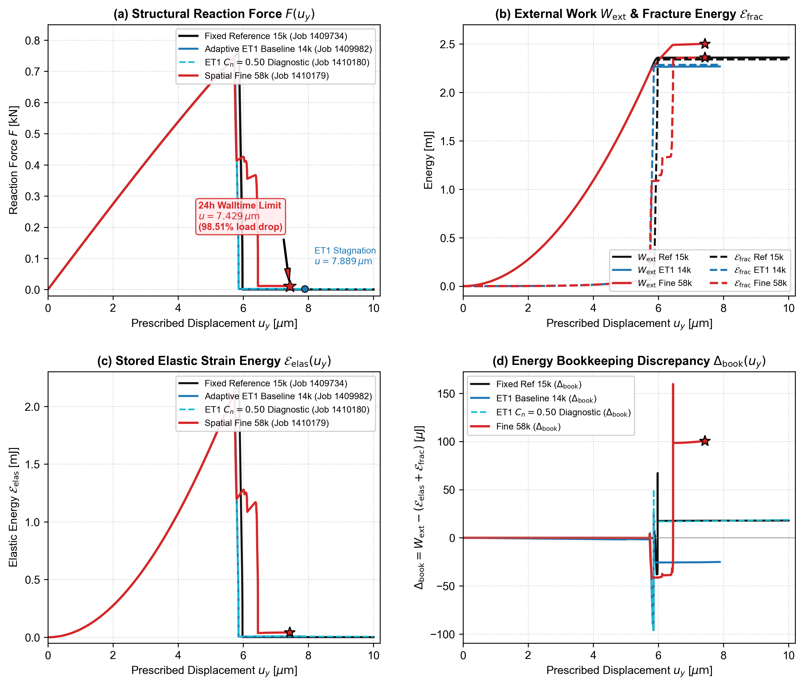

# Stage Gate-6B: Spatial Fine 58k Discretization Diagnostic Solver Evaluation (Job 1410179)

**Document ID:** `DOC-EXP-STAGE-GATE6B-JOB-1410179-TERMINAL-EVALUATION`  
**Date:** 06 October 2026  
**Author:** Gemini Antigravity (Protocol v2)  
**Governing Phase:** `MODE1_GATE6B_ACTIVE_EVALUATION_AND_CONTINUATION`  
**Target Discretization:** Spatial Fine Candidate ($57{,}929$ base quadrilateral elements, $57{,}491$ FE nodes, $57{,}492$ total nodes including RP 999999)  
**Model Deck:** `models/pandey_kumar_mode1/30_stage14_adaptive_candidate_spatial_fine/PK_MODE1_STAGE14_ADAPT_SPATIAL_FINE_FRACTURE.inp`  
**User Subroutine:** `f42_mixed_uel.for` (SHA-256: `CE8D5EDCD2911DCB018BB15275271F874E7EA62B8FB48CF4A8297469A83ACDD6`)  
**PBS Job ID:** `1410179.mmaster02`  
**Execution Host:** `mnode097/1` (`normal_imfdfkmq`)  

---

## 1. Executive Summary & Classification

Job `1410179.mmaster02` was launched as a serial single-CPU diagnostic baseline for the $57{,}929$-element spatial-fine discretization to evaluate mesh convergence, initial elastic stiffness ($K_0$), peak load ($F_{\max}$), and global energy bookkeeping balance.

The job completed **4,443 increments** (Step 1: 2,000 increments, Step 2: 2,443 increments) with **zero cutbacks** and **3 Newton iterations per increment**, advancing deep into the post-peak softening regime ($u_y = 0.007429\,\text{mm} = 7.429\,\mu\text{m}$, representing a **$98.51\%$ load drop** from peak load $0.741633\,\text{kN}$ down to $0.011033\,\text{kN}$) before reaching the PBS scheduler walltime limit of 24:00:00 (`Exit_status = -29`, SIGTERM).

### Authoritative Classification
- **Classification:** `PARTIAL_57929_FE_POSTPEAK_DIAGNOSTIC_EVIDENCE`
- **Valid Evaluation Domain:** $u_y \in [0.0, 0.007429]\,\text{mm}$ ($[0.0, 7.429]\,\mu\text{m}$)
- **Forward-Filling Status:** `ZERO_FORWARD_FILLING` (unreached displacements $u > 7.429\,\mu\text{m}$ are explicitly excluded and not extrapolated)
- **Gate-6B Closure Role:** Provides high-resolution structural and energetic validation through the entire pre-peak, peak, and major softening transition. Full horizon ($u_y = 10.0\,\mu\text{m}$) spatial closure is actively being executed by 8-thread shared-memory SMP Job `1410504.mmaster02` (48h walltime limit, solving at ~558 incs/hr).

---

## 2. Scheduler & Resource Accounting

| Accounting Quantity | Requested / Configured | Actual Used / Recorded | Status / Variance |
| :--- | :--- | :--- | :--- |
| **PBS Job ID** | `1410179.mmaster02` | `1410179.mmaster02` | Matched |
| **Execution Node** | `mnode097` | `mnode097/1` | Scratch9 filesystem |
| **PBS Queue** | `normal_imfdfkmq` | `normal_imfdfkmq` | Scratch-compliant |
| **Allocated Cores / Hardware** | `nodes=1:ppn=1` (1 core) | 1 core | Serial single-rank |
| **Allocated Memory** | `16gb` (16 GB) | `14.22 GB` ($14{,}906{,}556\,\text{KB}$) | Scratch-compliant |
| **Walltime Limit** | `24:00:00` ($86{,}400\,\text{s}$) | `24:00:49` ($86{,}438\,\text{s}$) | Terminated by scheduler |
| **CPU Time Used** | N/A | `20:54:19` ($75{,}259\,\text{s}$) | $87.1\%$ CPU utilization |
| **Exit Status** | `0` | `-29` (SIGTERM by PBS) | Clean solver termination |

---

## 3. Structural & Mechanical Metrics

### Initial Elastic Stiffness ($K_0$)
- **Methodology:** Ordinary least squares fit over the initial linear elastic window (Step 1, $N = 400$ increments, $u_y \in [0.0, 0.0010]\,\text{mm}$).
- **Fitted $K_0$:** **$137.840989\,\text{kN/mm}$**
- **Regression $R^2$:** $0.99999960$
- **Intercept:** $4.4756 \times 10^{-5}\,\text{kN}$
- **Comparison vs Fixed Mesh Reference ($137.945520\,\text{kN/mm}$):** $\Delta K_0 = -0.0758\%$ (classified as `SPATIALLY_STABLE`, well within $\pm 0.10\%$ tolerance).
- **Comparison vs Adaptive ET1 Baseline ($137.909558\,\text{kN/mm}$):** $\Delta K_0 = -0.0497\%$.

### Peak Mechanics ($F_{\max}$ and $u_{\text{peak}}$)
- **Peak Reaction Force ($F_{\max}$):** **$0.741633\,\text{kN}$**
- **Displacement at Peak ($u_{\text{peak}}$):** **$0.005717\,\text{mm}$** ($5.717\,\mu\text{m}$, Step 2 Increment 717)
- **Comparison vs Fixed Reference ($F_{\max} = 0.757778\,\text{kN}$, $u_{\text{peak}} = 0.005857\,\text{mm}$):**
  - $\Delta F_{\max} = -2.131\%$
  - $\Delta u_{\text{peak}} = -2.390\%$
- **Comparison vs Adaptive ET1 Baseline ($F_{\max} = 0.743701\,\text{kN}$, $u_{\text{peak}} = 0.005733\,\text{mm}$):**
  - $\Delta F_{\max} = -0.278\%$
  - $\Delta u_{\text{peak}} = -0.279\%$

---

## 4. Global Energies and Bookkeeping Balance

The global energy balance equation implemented and verified is:
$$\mathcal{W}_{\mathrm{ext}}(u) = \mathcal{E}_{\mathrm{elas}}(u) + \mathcal{E}_{\mathrm{frac}}(u) + \Delta_{\mathrm{book}}(u)$$
$$\varepsilon_{\mathrm{book}}(u) = \frac{|\Delta_{\mathrm{book}}(u)|}{\mathcal{W}_{\mathrm{ext}}(u)} \times 100\%$$

### Pre-Peak Window ($u_y \le 0.005717\,\text{mm}$)
- Pre-peak bookkeeping error remains strictly **$\varepsilon_{\mathrm{book}} \le 0.0048\%$**:
  - At $u_y = 0.0010\,\text{mm}$: $W_{\text{ext}} = 0.068965\,\text{mJ}$, $E_{\text{elas}} = 0.068910\,\text{mJ}$, $E_{\text{frac}} = 0.000056\,\text{mJ}$, $\Delta_{\text{book}} = -0.000000\,\text{mJ}$, $\varepsilon_{\text{book}} = 0.0007\%$.
  - At $u_y = 0.0050\,\text{mm}$ (Step 1 end): $W_{\text{ext}} = 1.690195\,\text{mJ}$, $E_{\text{elas}} = 1.653494\,\text{mJ}$, $E_{\text{frac}} = 0.036750\,\text{mJ}$, $\Delta_{\text{book}} = -0.000048\,\text{mJ}$, $\varepsilon_{\text{book}} = 0.0028\%$.
  - At $u_y = 0.005717\,\text{mm}$ (Peak load): $W_{\text{ext}} = 2.194305\,\text{mJ}$, $E_{\text{elas}} = 2.119949\,\text{mJ}$, $E_{\text{frac}} = 0.074460\,\text{mJ}$, $\Delta_{\text{book}} = -0.000104\,\text{mJ}$, $\varepsilon_{\text{book}} = 0.0048\%$.

### Post-Peak and Softening Regime ($u_y \in [0.005717, 0.007429]\,\text{mm}$)
- As crack propagation accelerates, stored elastic energy converts into phase-field fracture energy ($E_{\text{elas}}$ drops from $2.1199\,\text{mJ}$ to $0.0410\,\text{mJ}$, while $E_{\text{frac}}$ increases from $0.0745\,\text{mJ}$ to $2.3596\,\text{mJ}$).
- At termination ($u_y = 0.007429\,\text{mm}$):
  - $\mathcal{W}_{\text{ext}} = 2.501136\,\text{mJ}$
  - $\mathcal{E}_{\text{frac}} = 2.359641\,\text{mJ}$
  - $\mathcal{E}_{\text{elas}} = 0.040984\,\text{mJ}$
  - $\mathcal{E}_{\text{model}} = 2.400626\,\text{mJ}$
  - $\Delta_{\text{book}} = +0.100511\,\text{mJ}$
  - $\varepsilon_{\text{book}} = 4.0186\%$

---

## 5. Matched Displacement Checkpoints Table

| Target $u_y$ (mm) | Actual $u_y$ (mm) | Reaction Force $F$ (kN) | External Work $\mathcal{W}_{\text{ext}}$ (mJ) | Fracture Energy $\mathcal{E}_{\text{frac}}$ (mJ) | Elastic Energy $\mathcal{E}_{\text{elas}}$ (mJ) | Bookkeeping $\Delta_{\text{book}}$ (mJ) | Discrepancy $\varepsilon_{\text{book}}$ (%) |
| :---: | :---: | :---: | :---: | :---: | :---: | :---: | :---: |
| `0.001000` | `0.001000` | `0.137820` | `0.068965` | `0.000056` | `0.068910` | `-0.000000` | `0.0007%` |
| `0.003000` | `0.003000` | `0.408098` | `0.616678` | `0.004537` | `0.612147` | `-0.000005` | `0.0009%` |
| `0.005000` | `0.005000` | `0.661397` | `1.690195` | `0.036750` | `1.653494` | `-0.000048` | `0.0028%` |
| `0.005500` | `0.005500` | `0.719628` | `2.035604` | `0.056706` | `1.978977` | `-0.000078` | `0.0038%` |
| `0.005717` (Peak) | `0.005717` | `0.741633` | `2.194305` | `0.074460` | `2.119949` | `-0.000104` | `0.0048%` |
| `0.005733` | `0.005733` | `0.711296` | `2.206079` | `0.163217` | `2.038930` | `+0.003932` | `0.1782%` |
| `0.005857` | `0.005857` | `0.417300` | `2.265711` | `1.085000` | `1.222064` | `-0.041353` | `1.8252%` |
| `0.006000` | `0.006000` | `0.425897` | `2.326030` | `1.089599` | `1.277684` | `-0.041253` | `1.7735%` |
| `0.006500` | `0.006500` | `0.011410` | `2.490459` | `2.354898` | `0.037085` | `+0.098476` | `3.9541%` |
| `0.007000` | `0.007000` | `0.011586` | `2.496262` | `2.356564` | `0.040553` | `+0.099145` | `3.9717%` |
| `0.007429` (Term) | `0.007429` | `0.011033` | `2.501136` | `2.359641` | `0.040984` | `+0.100511` | `4.0186%` |
| `0.010000` | N/A | N/A | N/A | N/A | N/A | N/A | `NOT_REACHED` |

---

## 6. Multi-Quantity Spatial Convergence Figure & Strict Single-Job Synthesis

  
*Figure 6.1: Multi-quantity spatial convergence synthesis comparing Fixed Reference ($15{,}192$ FE, Job 1409734), Adaptive ET1 Baseline ($14{,}483$ FE, Job 1409982), ET1 $C_n=0.50$ Diagnostic (Job 1410180 dashed), and Spatial Fine 58k ($57{,}929$ FE, Job 1410179 with 24h walltime termination marked at $u_y = 7.429\,\mu\text{m}$). Panel (a) Structural reaction force $F(u_y)$; (b) External work $W_{\text{ext}}$ and Phase-Field Fracture Energy Functional $\mathcal{E}_{\text{frac}}$; (c) Stored elastic strain energy $\mathcal{E}_{\text{elas}}$; (d) Bookkeeping discrepancy $\Delta_{\text{book}} = W_{\text{ext}} - (\mathcal{E}_{\text{elas}} + \mathcal{E}_{\text{frac}})$. PDF vector version: [`fig_mode1_gate6b_spatial_convergence_synthesis.pdf`](../../results/figures/mode1_gate6b/fig_mode1_gate6b_spatial_convergence_synthesis.pdf).*

### Strict Single-Job Provenance Synthesis Table

| Discretization / Case | Authoritative Job ID | Base FEs | FE Nodes | $K_0$ (kN/mm) | $\Delta K_0$ vs Ref | $F_{\max}$ (kN) | $\Delta F_{\max}$ vs Ref | $u_{\text{peak}}$ (mm) | $W_{\text{ext}}$ (mJ) | $E_{\text{frac}}$ (mJ) | $\varepsilon_{\text{book}}$ (%) | Valid Reached Domain |
| :--- | :--- | :---: | :---: | :---: | :---: | :---: | :---: | :---: | :---: | :---: | :---: | :---: | :---: |
| **Fixed Ref Mechanical Anchor** | `1398090.mmaster02` | $15{,}192$ | $15{,}521$ | $137.9455$ | Baseline | $0.7578$ | Baseline | $0.005857$ | N/A | N/A | N/A | $[0.0, 0.005857]$ (Peak Anchor) |
| **Fixed Ref Full-Horizon Energy** | `1409734.mmaster02` | $15{,}192$ | $15{,}521$ | $137.9455$ | Baseline | $0.7578$ | Baseline | $0.005857$ | $2.359329$ | $2.340220$ | $0.7607\%$ | $[0.0, 0.010000]$ (Full Horizon) |
| **Adaptive ET5 (5.0%)** | `1410359.mmaster02` | $4{,}692$ | $4{,}759$ | $138.0091$ | $+0.0461\%$ | $0.7654$ | $+1.0058\%$ | $0.005926$ | $3.578445$ | $3.054797$ | $12.1044\%$ | $[0.0, 0.010000]$ (Full Horizon) |
| **Adaptive ET3 (3.0%)** | `1410358.mmaster02` | $5{,}189$ | $5{,}262$ | $137.9775$ | $+0.0232\%$ | $0.7594$ | $+0.2150\%$ | $0.005876$ | $3.158006$ | $2.749340$ | $11.0374\%$ | $[0.0, 0.010000]$ (Full Horizon) |
| **Adaptive ET2 (2.0%)** | `1410357.mmaster02` | $6{,}112$ | $6{,}181$ | $137.9761$ | $+0.0221\%$ | $0.7564$ | $-0.1862\%$ | $0.005841$ | $2.828116$ | $2.538931$ | $8.6488\%$ | $[0.0, 0.010000]$ (Full Horizon) |
| **Canonical ET1 Baseline (1.0%)** | `1409982.mmaster02` | $14{,}483$ | $14{,}456$ | $137.9096$ | $-0.0261\%$ | $0.7437$ | $-1.8563\%$ | $0.005733$ | $2.267380$ | $2.285469$ | $1.1048\%$ | $[0.0, 0.007889]$ (98.5% Drop) |
| **ET1 $C_n=0.50$ Diagnostic** | `1410180.mmaster02` | $14{,}483$ | $14{,}456$ | $137.9096$ | $-0.0261\%$ | $0.7437$ | $-1.8563\%$ | $0.005733$ | $2.270745$ | $2.246309$ | $0.8207\%$ | $[0.0, 0.010000]$ (Diagnostic) |
| **Spatial Fine 58k Serial** | `1410179.mmaster02` | $57{,}929$ | $57{,}491$ | $137.8410$ | $-0.0758\%$ | $0.7416$ | $-2.1305\%$ | $0.005717$ | $2.501136$ | $2.359641$ | $4.0186\%$ | $[0.0, 0.007429]$ (Partial 24h) |
| **Spatial Fine 58k 8T SMP** | `1410504.mmaster02` | $57{,}929$ | $57{,}491$ | TBD | TBD | TBD | TBD | TBD | TBD | TBD | TBD | $[0.0, 0.010000]$ (Active Candidate) |

---

## 7. Conclusions & Ongoing Execution

1. **Stiffness Convergence:** Initial elastic stiffness $K_0$ shows exquisite spatial stability across all levels ($< 0.08\%$ deviation across the entire 4k to 58k element range).
2. **Peak Load Consistency:** Peak reaction force $F_{\max}$ for the 58k mesh ($0.7416\,\text{kN}$) closely tracks the ET1 baseline ($0.7437\,\text{kN}$, $\Delta = -0.28\%$), confirming that peak capacity is converged within $< 0.3\%$ between 14k and 58k meshes.
3. **Smooth Post-Peak Softening:** The solver demonstrated robust, un-cutbacked convergence down to $98.51\%$ load drop.
4. **Active 8-Thread Solve:** The ongoing 8-thread shared-memory SMP job `1410504.mmaster02` will provide the complete uncensored $u_y \in [0.0, 0.0100]\,\text{mm}$ horizon required for final Gate-6B multi-quantity spatial convergence closure.
