# Adaptive Refinement Framework Methodology for Phase-Field Fracture in Abaqus

**Protocol Version:** 2  
**Classification:** `METHODOLOGY_SPECIFICATION`  
**Governing Context:** Master's Thesis Adaptive Refinement Framework (Post-08 October 2026 Roadmap).

---

## 1. Scope and Mathematical Definitions

This document formalizes the numerical definitions, workflow procedures, and state-transfer verification gates for the adaptive mesh refinement framework applied to phase-field fracture simulations in Abaqus.

### 1.1 Structural Loading and Solution Variables

To ensure unambiguous scientific reporting, the following distinct levels of discretization are strictly separated:

1. **Total Loading Horizon ($u_{\text{horizon}}$):**
   The complete prescribed displacement domain over which the boundary value problem is solved, e.g., $u_y \in [0, 10]\,\mu\text{m}$ for Mode-I, $u_x \in [0, 20]\,\mu\text{m}$ for Mode-II.

2. **Abaqus Analysis Steps ($N_{\text{step}}$):**
   The partition of the total loading process into $N_{\text{step}} \in \{1, 2, 4, \dots\}$ sequential Abaqus analysis steps:
   $$\Omega \times [0, T] = \bigcup_{s=1}^{N_{\text{step}}} \left( \Omega \times [t_{s-1}, t_s] \right)$$
   Each step $s$ carries its own boundary condition targets, output frequencies, and stabilization settings.

3. **Equilibrium Increments ($\Delta t_i, \Delta u_i$):**
   The internal sub-increments chosen by the Abaqus solver within Step $s$. Increment sizes are bounded by user-defined controls:
   $$\Delta u_i = \Delta t_i \cdot \dot{u}_{\text{prescribed}} \le \Delta u_{\max}$$
   *Crucially, dividing loading into more Abaqus steps does NOT imply fewer or larger equilibrium increments; $\Delta u_{\max}$ is controlled independently.*

4. **Remeshing Events ($N_{\text{remesh}}$):**
   The discrete instances at which mesh adaptation, error evaluation, and topology regeneration occur.

---

## 2. The Three Numerical Methodologies

```mermaid
flowchart TD
    subgraph Method_A["Method A: Two-Pass Pre-Refinement (Baseline Anchor)"]
        A1["1. Coarse Pre-Analysis (Single or Multi-Step)"] --> A2["2. Stress Discretization Error Evaluation (MISESERI)"]
        A2 --> A3["3. Sizing Field Calculation & adaptiveRemesh"]
        A3 --> A4["4. Deterministic 3-Layer UEL/UMAT Deck Rebuild"]
        A4 --> A5["5. Fresh Phase-Field Fracture Solve from t=0"]
        A5 --> A6["Zero State Transfer — No Numerical Diffusion"]
    end

    subgraph Method_B["Method B: Configurable Load Partitioning"]
        B1["1. Coarse Pre-Analysis with 1, 2, or 4 Abaqus Steps"] --> B2["2. Systematic Evaluation at Step Boundaries (t_s)"]
        B2 --> B3["3. Single Remeshing Operation on Selected Frame"]
        B3 --> B4["4. Fresh Phase-Field Fracture Solve from t=0"]
        B4 --> B5["Isolates Load Schedule Effects on Mesh Refinement"]
    end

    subgraph Method_C["Method C: Sequential Adaptive Remeshing (Gated Extension)"]
        C1["1. Solve Loading Interval [t_k, t_{k+1}] on Mesh M_k"] --> C2["2. Evaluate Solution Error & Damage Localization"]
        C2 --> C3["3. Generate Adapted Mesh M_{k+1}"]
        C3 --> C4["4. State Transfer Gate: Map u, d, H, STATEVs"]
        C4 --> C5{"State-Transfer & Energy Audit"}
        C5 -->|Pass: Monotonicity & Energy Preserved| C6["5. Continue Solve on Mesh M_{k+1}"]
        C5 -->|Fail: Gradient Diffusion / Energy Jump| C7["Halt / Diagnostic Rollback"]
    end
```

### 2.1 Method A: Two-Pass Pre-Refinement (Pandey–Kumar Reference)
- **Concept:** A coarse linear-elastic continuum simulation is executed over the full or partial loading horizon. The stress error indicator $\text{MISESERI}$ is evaluated to identify stress concentration regions (e.g., crack tips). An adapted mesh is generated once, and the full phase-field fracture problem is solved from undamaged initial conditions ($t=0$).
- **Advantages:** Completely avoids mapping errors, history interpolation, and phase-field gradient diffusion.
- **Role:** The verified reference anchor against which all extensions are measured.

### 2.2 Method B: Configurable Load Partitioning
- **Concept:** Investigates the impact of dividing the coarse loading horizon into $1$, $2$, or $4$ Abaqus steps.
- **Physical Rationale:** As displacement increases, stress concentrations sharpen until damage initiates, after which stress relaxes. Evaluating $\text{MISESERI}$ at different intermediate load stages tests whether multi-step scheduling improves refinement corridor capture before damage onset.
- **Execution:** Mesh is adapted once based on the selected step/frame, followed by a fresh simulation from $t=0$. Zero state transfer is required.

### 2.3 Method C: Sequential Adaptive Remeshing (Gated Extension)
- **Concept:** The simulation runs incrementally. At intermediate loading intervals, the mesh is adapted to track the propagating crack front, transferring all necessary solution variables before continuing.
- **Status:** Separately gated research objective. Must pass mandatory state-transfer and irreversibility validation before production deployment.

---

## 3. Mathematical Requirements for Phase-Field State Transfer (Method C)

When transferring state from donor discretization $\mathcal{M}_{\text{donor}}$ to target discretization $\mathcal{M}_{\text{target}}$, the following physical and numerical invariants must be rigorously verified:

### 3.1 Phase-Field Irreversibility and Monotonicity
The phase-field damage variable $d \in [0, 1]$ represents crack surface topology. Damage cannot heal:
$$\dot{d}(\mathbf{x}, t) \ge 0 \implies d_{n+1}(\mathbf{x}) \ge d_n(\mathbf{x}) \quad \forall \mathbf{x} \in \Omega$$
- **Transfer Requirement:** Interpolation or projection to target nodes/integration points must strictly enforce:
  $$d_{\text{target}}(\mathbf{x}) \ge d_{\text{donor}}(\mathbf{x}) - \epsilon_{\text{mach}}$$
  Spurious numerical undershoots ($d < 0$) or overshoots ($d > 1$) must be strictly clipped.

### 3.2 Gradient Preservation and Numerical Diffusion
The phase-field crack surface energy is defined by:
$$\Gamma_l(d) = \int_\Omega \left( \frac{d^2}{2l_0} + \frac{l_0}{2} |\nabla d|^2 \right) d\Omega$$
- **Gradient Diffusion Hazard:** Standard nodal interpolation across non-matching elements acts as a low-pass filter, flattening steep gradients ($|\nabla d_{\text{target}}| < |\nabla d_{\text{donor}}|$). This artificially reduces the computed fracture surface energy, altering crack initiation thresholds.
- **Verification Gate:**
  $$\|d_{\text{target}} - d_{\text{donor}}\|_{L_2} \le \delta_d, \qquad \|\nabla d_{\text{target}} - \nabla d_{\text{donor}}\|_{L_2} \le \delta_{\nabla d}$$

### 3.3 Strain-History Variable Mapping
The crack driving force is governed by the historical maximum positive elastic energy density:
$$\mathcal{H}(\mathbf{x}, t) = \max_{\tau \in [0, t]} \psi_0^+(\boldsymbol{\epsilon}(\mathbf{x}, \tau))$$
- **Integration-Point Mapping:** $\mathcal{H}$ is defined at element integration points. Transfer must map $\mathcal{H}_{\text{donor}} \to \mathcal{H}_{\text{target}}$ without introducing localized artificial stress peaks that could cause spurious crack branching.

### 3.4 Global Energy Balance Across Transfer
Total energy immediately before and after transfer must satisfy:
$$\Delta E_{\text{transfer}} = \left| E_{\text{total}}(\mathcal{M}_{\text{target}}) - E_{\text{total}}(\mathcal{M}_{\text{donor}}) \right| \le \epsilon_{\text{energy}}$$
where $E_{\text{total}} = E_{\text{elas}} + E_{\text{frac}}$.

---

## 4. Total Computational Cost Accounting

Computational efficiency must evaluate the entire pipeline overhead, not merely solver execution time on the adapted mesh:

$$T_{\text{total}} = T_{\text{coarse\_pre}} + T_{\text{error\_eval}} + T_{\text{remeshing}} + T_{\text{state\_transfer}} + T_{\text{fine\_solver}} + T_{\text{postproc}}$$

| Cost Component | Method A | Method B | Method C |
| :--- | :---: | :---: | :---: |
| $T_{\text{coarse\_pre}}$ (Coarse pre-analysis) | Yes | Yes (Multi-step) | Yes (Initial only) |
| $T_{\text{error\_eval}}$ (MISESERI evaluation) | Yes (1 pass) | Yes (1 pass) | Yes ($N_{\text{remesh}}$ passes) |
| $T_{\text{remeshing}}$ (CAE remesh + deck rebuild) | Yes (1 pass) | Yes (1 pass) | Yes ($N_{\text{remesh}}$ passes) |
| $T_{\text{state\_transfer}}$ (Mesh-to-mesh mapping) | **0** | **0** | Yes ($N_{\text{remesh}}$ passes) |
| $T_{\text{fine\_solver}}$ (Abaqus fracture solve) | Full ($t=0 \to T$) | Full ($t=0 \to T$) | Incremental stages |

A lower finite-element count alone does not establish superiority if remeshing and state-transfer overhead exceed the solver runtime savings.
