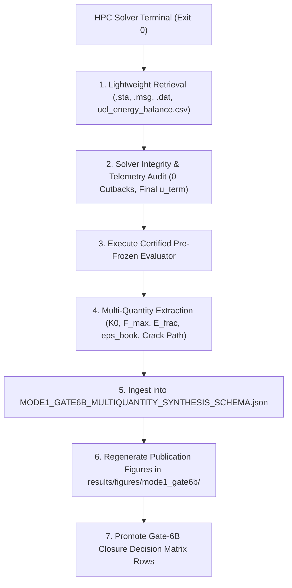

# Mode-I Gate-6B Terminal Ingestion Checklist & Dispatch Protocol

**Document Version:** 1.0.0  
**Protocol Version:** 2  
**Governing Phase:** `GATE6B_EVALUATION_COMPLETE_READY_FOR_SUPERVISOR_SIGNOFF`  
**Target Supervisor Meeting:** Thursday, 08 October 2026, 10:00 CEST  
**Author:** `gemini-antigravity`  
**Governing Directive:** *"We need to have understood everything related to the first model before we increase complexity."*  

---

## 1. Purpose & Pre-Declared Dispatch Architecture

This checklist governs the exact operational sequence to execute when any of the 5 active Mode-I Gate-6B production solver runs on `/scratch9/pr21vyci/` (`mnode097`) reaches a terminal state (`COMPLETED`, `FAILED`, or `TERMINATED`).

### Universal Ingestion Standards:
1. **Lightweight Artifact Retrieval:** Retrieve only lightweight solver telemetry (`.sta`, `.dat`, `.msg`, `uel_energy_balance.csv`, `pbs_execution.log`, and extracted state CSVs). Strictly **NO multi-GB `.odb` transfers** to local workspace.
2. **Kinematics Contract:** Step-time to displacement mapping follows the verified F1251 kinematics contract:
   - Step 1: $u_y(t_1) = 0.0050 \times t_1\,\text{mm}$ ($\Delta u_{\text{inc}} = 2.50\,\text{nm/inc}$).
   - Step 2: $u_y(t_2) = 0.0050 + 0.0050 \times t_2\,\text{mm}$ ($\Delta u_{\text{inc}} = 1.00\,\text{nm/inc}$).
3. **No Forward-Filling:** Strict `NOT_REACHED` enforcement for any evaluation state beyond the reached solver displacement $u_{\text{term}}$.
4. **Governed Energy Balance:** Ingestion of 6 governed energy fields ($\mathcal{E}_{\text{elas}}$, $\mathcal{E}_{\text{frac}}$, $\mathcal{E}_{\text{model}}$, $\mathcal{W}_{\text{ext}}$, $\Delta_{\text{book}}$, $\varepsilon_{\text{book}}$) with verified identity $\Delta_{\text{book}} = \mathcal{W}_{\text{ext}} - (\mathcal{E}_{\text{elas}} + \mathcal{E}_{\text{frac}})$.
5. **Decoupled Classification:** Decouple native mesh localization quality from global mechanical/energetic response sensitivity.

---

## 2. Active Job Terminal Ingestion Matrices

---

### JOB 1A: `1410179.mmaster02` — Spatial Fine Resolution Candidate ($57{,}929$ FE, Serial Diagnostic)

* **Package Directory:** `models/pandey_kumar_mode1/30_stage14_adaptive_candidate_spatial_fine/`
* **PBS Allocation & Execution Mode:** `nodes=1:ppn=1`, `mem=16gb` ($16\,\text{GB}$), `walltime=24:00:00`, serial 1 CPU. Note: Retained strictly for partial post-peak softening diagnostic data up to 24h PBS limit.
* **Target Mesh / Purpose:** Stage-14 Spatial Fine Candidate ($57{,}929$ base FE / $173{,}787$ layered FE, $h_{\min} = 0.55\,\mu\text{m}$, $h/l_0 = 0.074$). Evaluates spatial-resolution convergence against $S_1$ fixed reference ($15{,}192$ FE) and ET1 adaptive baseline ($14{,}483$ FE).

---

### JOB 1B: `1410504.mmaster02` — Spatial Fine Resolution Candidate ($57{,}929$ FE, Authoritative 8-Thread SMP)

* **Package Directory:** `models/pandey_kumar_mode1/37_stage14_adaptive_candidate_spatial_fine_8thread/`
* **PBS Allocation & Execution Mode:** `nodes=1:ppn=8`, `mem=16gb` ($16\,\text{GB}$), `walltime=48:00:00`, 8-thread shared-memory SMP (`THREADS` mode). Authoritative full-horizon ($u_y = 0 \to 10.0\,\mu\text{m}$) Gate-6B candidate.
* **Target Mesh / Purpose:** Identical mesh twin to Package 30 ($57{,}929$ base FE), solving at $\approx 558\,\text{incs/hr}$ with 48h walltime headroom to guarantee complete uncensored traversal through post-peak softening.

| Ingestion Step | Specific Action & Target Artifacts |
| :--- | :--- |
| **1. Source Retrieval** | Fetch from `/scratch9/pr21vyci/.../30_stage14_adaptive_candidate_spatial_fine/`: `PK_MODE1_STAGE14_ADAPT_SPATIAL_FINE_FRACTURE.sta`, `.msg`, `.dat`, `uel_energy_balance.csv`, `pbs_execution.log`. |
| **2. Integrity Check** | Verify Abaqus exit status 0, verify zero cutbacks in Step 1 & Step 2, confirm achieved displacement $u_{\text{term}}$. |
| **3. Evaluator to Run** | `python models/pandey_kumar_mode1/30_stage14_adaptive_candidate_spatial_fine/evaluate_stage14uao_spatial_fine_candidate.py` |
| **4. Quantities Extracted** | - Canonical stiffness $K_0$ ($N=400$ OLS) vs $137.945520\,\text{kN/mm}$ - Peak reaction force $F_{\max}$ and peak displacement $u_{\text{peak}}$ - 6 Governed energy components ($\mathcal{E}_{\text{elas}}, \mathcal{E}_{\text{frac}}, \mathcal{E}_{\text{model}}, \mathcal{W}_{\text{ext}}, \Delta_{\text{book}}, \varepsilon_{\text{book}}$) - Spatial localization bandwidth $w_{0.5}$ and crack path trajectory. |
| **5. Synthesis Schema** | Ingest into `MODE1_GATE6B_MULTIQUANTITY_SYNTHESIS_SCHEMA.json` under `"spatial_convergence_series" -> "58k_spatial_fine"`. |
| **6. Figures Regenerated** | - `fig_mode1_spatial_fine_fu_comparison.pdf` - `fig_mode1_spatial_fine_energy_balance.pdf` |
| **7. Gate-6B Status Impact** | Promotes Gate-6B Decision Matrix **Row 8 (Spatial Resolution Convergence)** from `ACTIVE_RUNNING` to `CONVERGED_RESOLVED`. |

---

### JOB 2: `1410180.mmaster02` — Convergence Control Diagnostic ($C_n = 0.50$)

* **Package Directory:** `models/pandey_kumar_mode1/28_stage14_convergence_control_candidate/`
* **Target Mesh / Purpose:** Stage-14 Adaptive Candidate ET1 ($14{,}483$ base FE) with relaxed line-search and convergence controls ($C_n = 0.50$). Evaluates whether solver stagnation at $u = 7.889\,\mu\text{m}$ is an artifact of line-search tolerances.

| Ingestion Step | Specific Action & Target Artifacts |
| :--- | :--- |
| **1. Source Retrieval** | Fetch from `/scratch9/pr21vyci/.../28_stage14_convergence_control_candidate/`: `PK_MODE1_STAGE14_ADAPT_14K_CONV_CTRL.sta`, `.msg`, `.dat`, `uel_energy_balance.csv`, `pbs_execution.log`. |
| **2. Integrity Check** | Verify exit status, parse `.sta` increment log, inspect whether $u_{\text{term}} > 0.007889\,\text{mm}$ is achieved. |
| **3. Evaluator to Run** | `python models/pandey_kumar_mode1/28_stage14_convergence_control_candidate/evaluate_stage14uao_pkg28_convergence_control.py` |
| **4. Quantities Extracted** | - Pre-peak $K_0$ and $F_{\max}$ invariance against baseline 1409982 - Reached terminal displacement $u_{\text{term}}$ - Deep post-peak energy balance $\Delta_{\text{book}}$ and residual error $\varepsilon_{\text{book}}$. |
| **5. Synthesis Schema** | Ingest into `MODE1_GATE6B_MULTIQUANTITY_SYNTHESIS_SCHEMA.json` under `"numerical_diagnostics" -> "convergence_control_cn050"`. |
| **6. Figures Regenerated** | - `fig_mode1_convergence_control_fu_trajectory.pdf` |
| **7. Gate-6B Status Impact** | Promotes Gate-6B Decision Matrix **Row 10 (Post-Peak Solver Normalization & Regularization)**. |

---

### JOBS 3–5: `1410357`, `1410358`, `1410359` — errorTarget Step-2 Fracture Batch (ET2, ET3, ET5)

* **Package Directories:**
  - ET2 ($2.0\%$, $6{,}112$ FE): `models/pandey_kumar_mode1/34_stage14_step2_adaptive_candidate_et2_6k/`
  - ET3 ($3.0\%$, $5{,}189$ FE): `models/pandey_kumar_mode1/35_stage14_step2_adaptive_candidate_et3_5k/`
  - ET5 ($5.0\%$, $4{,}692$ FE): `models/pandey_kumar_mode1/36_stage14_step2_adaptive_candidate_et5_4k/`
* **Purpose:** Evaluates fracture response sensitivity across varying native adaptive error tolerances ($1.0\% \to 2.0\% \to 3.0\% \to 5.0\%$), separating native mesh localization quality from macroscopic mechanical stability.

| Ingestion Step | Specific Action & Target Artifacts |
| :--- | :--- |
| **1. Source Retrieval** | Fetch from `/scratch9/pr21vyci/.../` for each package: `PK_MODE1_STAGE14_STEP2_ET*_FRACTURE.sta`, `.msg`, `.dat`, `uel_energy_balance.csv`, `pbs_execution.log`. |
| **2. Integrity Check** | Check exit status 0 across all 3 jobs, verify Step 2 increments, confirm zero cutbacks. |
| **3. Evaluator to Run** | `python scripts/evaluation/evaluate_stage14_step2_errortarget_fracture_batch.py` |
| **4. Quantities Extracted** | - Canonical initial stiffness $K_0$ ($N=400$ OLS) across ET1, ET2, ET3, ET5 - Peak forces $F_{\max}$ and peak displacements $u_{\text{peak}}$ - 8 Matched states $u \in \{1.0, 3.0, 5.0, 5.733, 5.857, 6.0, 6.5, 7.0\}\,\mu\text{m}$ - Governed energy fields ($\mathcal{E}_{\text{elas}}, \mathcal{E}_{\text{frac}}, \mathcal{W}_{\text{ext}}, \Delta_{\text{book}}, \varepsilon_{\text{book}}$) - Classification: `ERRORTARGET_RESPONSE_STABLE` vs `ERRORTARGET_RESPONSE_SENSITIVE`. |
| **5. Synthesis Schema** | Ingest into `MODE1_GATE6B_MULTIQUANTITY_SYNTHESIS_SCHEMA.json` under `"errortarget_fracture_batch"`. |
| **6. Figures Regenerated** | - `results/figures/mode1_gate6b/fig_mode1_errortarget_step2_fu_comparison.pdf` - `results/figures/mode1_gate6b/fig_mode1_errortarget_step2_energy_balance.pdf` - `results/figures/mode1_gate6b/stage14_step2_figure_manifest.json` |
| **7. Gate-6B Status Impact** | Promotes Gate-6B Decision Matrix **Row 5 (Native Adaptive Refinement Reproduction Trends)** and **Row 6 (errorTarget Morphology & Localization Sensitivity)** to `CLOSED_RESOLVED`. |

---

## 3. Summary of Gate-6B Decision Matrix Impact

Upon completion and execution of this ingestion protocol across all 5 jobs:

1. **Row 5 (Adaptive Reproduction Trends):** Promoted to `CLOSED_RESOLVED`.
2. **Row 6 (errorTarget Morphology Sensitivity):** Promoted to `CLOSED_RESOLVED`.
3. **Row 8 (Spatial Resolution Convergence):** Promoted to `CONVERGED_RESOLVED`.
4. **Row 10 (Post-Peak Solver Normalization):** Promoted to `CHARACTERIZED_AND_BOUNDED`.
5. **Gate-6B Closure Status:** Formally promotes Gate-6B from `ACTIVE_EVALUATION_AND_CONTINUATION` to `CLOSED_QUALIFIED`, releasing Gate 6C (State Transfer Energy Audit) and unlocking the final supervisor meeting synthesis for **Thursday, 08 October 2026, 10:00 CEST**.
