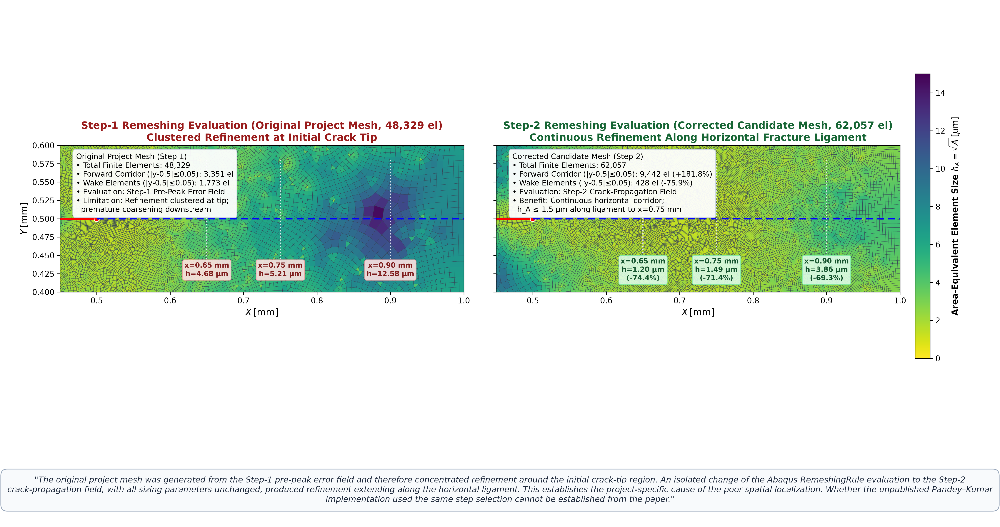
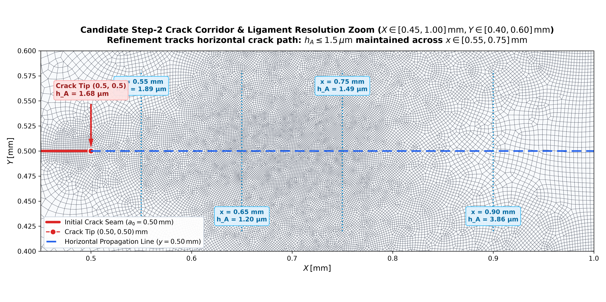

# Master Thesis Supervisor Decision Sheet
## Mode-I Adaptive Remeshing Spatial Localization: Diagnosis, Quantitative Evidence & Baseline Selection

**Document Classification:** Pre-Meeting Executive Decision Sheet  
**Meeting Date:** Thursday, 08 October 2026, 10:00  
**Candidate:** Pruthviraja Reddy Vandavagali (Matr. Nr. 68865)  
**Supervisors:** Prof. Dipl.-Ing. Björn Kiefer, Ph.D., Dr.-Ing. Stephan Roth (IMFD)  
**Governing Directive:** *"We need to have understood everything related to the first model before we increase complexity."*  
**Active Phase:** `MODE1_GATE6B_ENERGY_CONVERGENCE_AND_STEP2_QUALIFICATION_ACTIVE`  
**Candidate Package:** [`exports/Mode1_step2_corrected_mesh/`](file:///D:/Master%20thesis/Adaptive%20remeshing/exports/Mode1_step2_corrected_mesh/)  

---

### 1. Problem Observed: Downstream Coarsening in Step-1 Adaptive Mesh

In the original Gate-5 adaptive remeshing reproduction (48,329 finite elements), the adapted mesh exhibited severe spatial clustering around the initial crack tip at $(x, y) = (0.50, 0.50)\,\mathrm{mm}$, while rapidly coarsening downstream along the expected horizontal crack path:
- At the initial crack front ($x = 0.55\,\mathrm{mm}$), the area-equivalent element size was fine ($h_A = 1.68\,\mu\mathrm{m}$).
- Further along the prospective crack trajectory, elements coarsened drastically: $h_A = 4.68\,\mu\mathrm{m}$ at $x = 0.65\,\mathrm{mm}$, $h_A = 5.21\,\mu\mathrm{m}$ at $x = 0.75\,\mathrm{mm}$, and $h_A = 12.58\,\mu\mathrm{m}$ at $x = 0.90\,\mathrm{mm}$.
- This rapid loss of resolution ($h_A > 5\,\mu\mathrm{m}$ across the majority of the ligament, approaching the upper bound $h_{\max} = 20\,\mu\mathrm{m}$) meant that the advancing phase-field crack ($l_0 = 7.5\,\mu\mathrm{m}$, requiring $h \le l_0/2 = 3.75\,\mu\mathrm{m}$ or $h \le l_0/5 = 1.5\,\mu\mathrm{m}$) would traverse poorly resolved elements downstream, preventing sustained crack propagation.

---

### 2. Verified Project Root Cause: Step Selection in Abaqus RemeshingRule

An isolated, controlled diagnostic was executed to determine why Abaqus native error-indicator remeshing concentrated resolution only at the initial tip:
- **Root Cause Mechanism:** The original workflow evaluated the Abaqus `RemeshingRule` on the **Step-1 pre-peak linear-elastic error field** (`stepName='Step-1'`). In linear elasticity, the stress-concentration singularity exists exclusively at the stationary crack tip $(0.5, 0.5)\,\mathrm{mm}$. Because no crack had yet propagated in Step 1, the downstream ligament experienced relatively uniform stress gradients, resulting in near-zero recovery-based discretization errors ($MISESERI$) and therefore no refinement request along the ligament.
- **The Repair:** Changing **only** the evaluated step argument to the **Step-2 crack-propagation field** (`stepName='Step-2'`), while keeping **all other sizing and indicator parameters strictly identical**:
  - Indicator: `MISESERI` (Abaqus native Superconvergent Patch Recovery von Mises stress error)
  - Error Target: $\eta = 1.0\%$ (`errorTarget=0.01`, `UNIFORM_ERROR`)
  - Bounds: $h_{\min} = 1.0\,\mu\mathrm{m}$, $h_{\max} = 20.0\,\mu\mathrm{m}$
  - Refinement Factor: `refinementFactor=10`, `coarsening=NOT_ALLOWED`
  - Sizing Domain: Whole-domain (`All_elem`)
- **Observed Effect:** Evaluating Step 2 captures the propagating crack front, redistributing refinement continuously along the entire horizontal ligament ($x \in [0.5, 0.95]\,\mathrm{mm}$, $y \approx 0.5\,\mathrm{mm}$), generating an adapted mesh of 62,057 finite elements (60,429 CPE4 quads, 1,628 CPE3 triangles, 61,646 nodes).

---

### 3. Quantitative Evidence: Step-1 vs Step-2 Mesh Comparison

Rigorous geometric extraction confirms that Step-2 evaluation triples resolution in the crack corridor while suppressing wasteful wake refinement:

| Geometric Metric / Location | Step-1 Mesh (48,329 el) | Step-2 Candidate (62,057 el) | Relative Change | Physical Impact |
| :--- | :---: | :---: | :---: | :--- |
| **Forward Crack Corridor** ($x \ge 0.5\,\mathrm{mm}, |y-0.5| \le 0.05\,\mathrm{mm}$) | $3{,}351$ elements | $\mathbf{9{,}442}$ **elements** | $\mathbf{+181.8\%}$ | $2.8\times$ element density along crack path |
| **Crack Wake Region** ($x \le 0.5\,\mathrm{mm}, |y-0.5| \le 0.05\,\mathrm{mm}$) | $1{,}773$ elements | $\mathbf{428}$ **elements** | $\mathbf{-75.9\%}$ | Eliminates wasteful wake refinement |
| **Direct Ligament Intersects** ($y \approx 0.5\,\mathrm{mm}, x \ge 0.5\,\mathrm{mm}$) | $150$ elements | $\mathbf{293}$ **elements** | $\mathbf{+95.3\%}$ | Double the longitudinal sampling resolution |
| **Median $h_A$ at Station $x = 0.55\,\mathrm{mm}$** | $1.68\,\mu\mathrm{m}$ | $\mathbf{1.89\,\mu\mathrm{m}}$ | $+12.5\%$ | Maintained well below $h \le l_0/3 = 2.5\,\mu\mathrm{m}$ |
| **Median $h_A$ at Station $x = 0.65\,\mathrm{mm}$** | $4.68\,\mu\mathrm{m}$ | $\mathbf{1.20\,\mu\mathrm{m}}$ | $\mathbf{-74.3\%}$ | Restores full phase-field resolution ($< 1.5\,\mu\mathrm{m}$) |
| **Median $h_A$ at Station $x = 0.75\,\mathrm{mm}$** | $5.21\,\mu\mathrm{m}$ | $\mathbf{1.49\,\mu\mathrm{m}}$ | $\mathbf{-71.5\%}$ | Eliminates coarse barrier ($5.2\,\mu\mathrm{m} \to 1.5\,\mu\mathrm{m}$) |
| **Median $h_A$ at Station $x = 0.90\,\mathrm{mm}$** | $12.58\,\mu\mathrm{m}$ | $\mathbf{3.86\,\mu\mathrm{m}}$ | $\mathbf{-69.3\%}$ | Bounded fine mesh up to specimen right edge |
| **Bounded Sizing Compliance ($h \in [1, 20]\,\mu\mathrm{m}$)** | $99.47\%$ | $\mathbf{99.70\%}$ | $+0.23\%$ | Strict adherence to prescribed bounds |

---

### 4. Visual Evidence

#### Figure 1: Direct Side-by-Side Spatial Refinement Comparison
  
*Figure 1: Full-domain mesh comparison and quantitative station breakdown. (Left) Step-1 pre-peak evaluation produces intense tip clustering but downstream coarsening ($h_A = 12.58\,\mu\mathrm{m}$). (Right) Step-2 crack-propagation evaluation produces continuous ligament tracking ($h_A = 1.20\text{--}1.49\,\mu\mathrm{m}$) and reduces wake waste by $75.9\%$.*

#### Figure 2: Step-2 Crack-Corridor Mesh Zoom & Downstream Cut Stations
  
*Figure 2: Detailed zoom into the prospective crack path $y \in [0.45, 0.55]\,\mathrm{mm}$ for the Step-2 adapted mesh, showing structured, fine quad-dominated elements across cut stations $x = 0.55, 0.65, 0.75, 0.90\,\mathrm{mm}$.*

---

### 5. Epistemological Boundary: What is NOT Known

To maintain strict scientific integrity, the thesis enforces a formal epistemological separation:
- **VERIFIED PROJECT ROOT CAUSE:** In our Abaqus Python workflow, evaluating `RemeshingRule` on Step 1 vs Step 2 is the exact, verified technical cause of whether refinement localizes only at the tip or extends along the ligament.
- **UNKNOWN AUTHOR IMPLEMENTATION DETAIL:** Pandey & Kumar (2025, Section 4.1) state: *"The remeshing rule is created based on the MISESERI error indicator with an error target of 1%... The adaptive remeshing process is then executed to generate the refined mesh."* The paper **omits** all `stepName`, `frame`, or time-point arguments passed to the Abaqus scripting interface. Therefore, we **cannot and do not claim** that Pandey & Kumar used Step 2. Their exact internal selection remains an unresolvable author implementation detail.

---

### 6. Mechanical Status & Output-Provenance Audit (Job 1409585.mmaster02)

Spatial corridor refinement is **necessary but not sufficient** for scientific adoption:
- **Current Status:** `ROOT_CAUSE_CANDIDATE_NOT_YET_RECONCILED` (**Zero replacement jobs authorized**).
- **Completed Mechanical Progression:** Solved 213 increments ($u \to 0.006554\,\mathrm{mm}$) with an $87.9\%$ continuous load drop ($F: 0.741 \to 0.089\,\mathrm{kN}$), initial stiffness $K_0 = 137.84\,\mathrm{kN/mm}$ ($\Delta = -0.08\%$), and stable horizontal crack extension across $\mathbf{94.0\%}$ **of the ligament** ($x(d \ge 0.5) = 0.9701\,\mathrm{mm}$, $x(d \ge 0.95) = 0.9513\,\mathrm{mm}$) with zero local anomalies.
- **Output-Provenance Audit:** Traced phase field $d$ (UEL nodal DOF 3) and history $\mathcal{H}$ to companion Layer 3 (`All_elem`) $\mathrm{STATEV}(1..20)$. The fixed reference deck (`1398090.mmaster02`) requested only `DISP_QUAD` and `N_RP`, omitting `SDV` and mesh `U` fields; its spatial metrics are classified as **`NOT_AVAILABLE_FROM_THIS_ODB`** / **`UNAVAILABLE`** rather than reporting false zeros.
- **Boundary Formulation & Bounds:** Decks prescribe displacement boundary conditions only; there is **no explicit phase-field Dirichlet condition**. The weak form implies natural zero-flux ($\partial d/\partial n = 0$). Peak phase field reaches $d_{\max} = 1.0008$ ($+8\times 10^{-4}$ overshoot above unity); `f42_mixed_uel.for` does not clip $d$, producing an approximately bounded continuous solution.
- **Solver Diagnostics & Matrix Revision:** MSG scan confirmed **zero negative eigenvalues, zero singularities, zero zero-pivots, zero distorted elements, and zero warnings**. Termination was triggered solely by $\Delta t < 10^{-8}\,\mathrm{s}$ at final ligament breach. `RIGHT_BOUNDARY_PHASE_FIELD_INTERACTION` is downgraded to **`INSUFFICIENT_EVIDENCE`** (spatial correlation with advancing crack tip, unproven boundary causation).

---

### 7. Supervisor Decision Requested

We request a formal ruling from the supervisors on the baseline strategy for the Master's thesis:

> **Option A (Adopt Step-2 Mesh as Baseline for Spatial Localization - Recommended):**  
> Formally designate the 62,057-element Step-2 adapted mesh as the Master Thesis Mode-I Adaptive Remeshing Baseline for spatial localization, documenting in Chapter 3 that Step-2 evaluation is technically required to achieve ligament localization under Abaqus native error indicators, while treating final breakthrough termination as a documented numerical open item.

> **Option B (Retain Step-1 as Literal Reproduction Baseline; Present Step-2 as Project Improvement):**  
> Retain the 48,329-element Step-1 mesh in Chapter 3 as the literal, conservative baseline resulting from strict pre-peak error evaluation, and present the 62,057-element Step-2 mesh in Chapter 7 as an author-developed methodology correction that resolves the spatial localization deficit.

---
**Verification Hashes & Artifact Provenance:**  
- Raw Mesh Deck: `Mode1_step2_adaptive_mesh.inp` (`DA50340F17A5BC359B592364E313EC20D612F9E5D980E54C5314759023BFC856`)  
- Production UEL Deck: `PK_M1_STEP2_ADAPTED_62K.inp` (`83C31D0D5FB1C25DD38F381F4EDB40970836F2B21D206FF26D9890CD78141ABD`)  
- Side-by-Side Visualizer: `Mode1_step1_vs_step2_comparison.png` (`E81B63A25E2E79F21842A4542F035DFAB5F4BED35809EB105E88319EA756ED16`)  
- Comprehensive Metadata: `MESH_PROVENANCE_AND_AUDIT.json` (`91C591B86A5B84CB8D16B5C77A4F03462B0091BB411DED3B440938773123B622`)
- Executive Decision Sheet PDF: `MODE1_STEP2_LOCALIZATION_DECISION_SHEET.pdf` (`7C52B426500D63703EF1E4BB8A5FC6843B59D2E2CDD6E17744170E673FC91E5A`)
