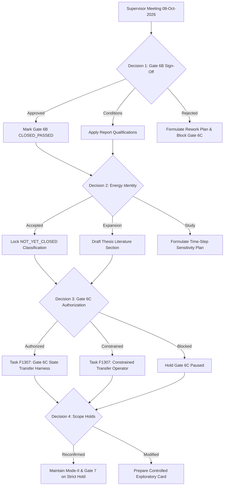

# Post-Meeting Execution Decision Matrix

**Authoritative Baseline:** Release `v2026.10.08-supervisor-meeting-mode1-freeze` (Commit `d988c5d7`)  
**Talk Track Reference:** `SUPERVISOR_MEETING_TALK_TRACK_FINAL.md` (Commit `ab4099d9`)  
**Target Milestone Review:** Thursday, 08 October 2026, 10:00 – 10:45 CEST  
**Candidate:** Candidate (`pr21vyci`)  
**Supervisors:** Prof. Dr. Björn Kiefer, Research Advisors (IMFD, TU Bergakademie Freiberg)  

---

## 1. Governing Principles & Anti-Deviation Guardrails

1. **Governing Directive:**
   > *"We need to have understood everything related to the first model before we increase complexity."*

2. **MANDATORY GOVERNANCE RULE: ZERO INFERRED APPROVAL:**
   - **Explicit Confirmation Mandatory:** Every state transition and new project task strictly requires unambiguous, explicitly recorded supervisor confirmation.
   - **No Spillover Authorization:** Approval of one decision item (e.g. Decision 1) does **NOT** constitute inferred or implied authorization for any subsequent item (e.g. Decision 3 or Decision 4).
   - **Silence / Ambiguity Default:** If supervisor feedback is ambiguous, unrecorded, or deferred, the execution path **FAILS CLOSED** to the conservative hold state. No downstream branch may execute.
   - **Scope Lock:** Mode-II (`Job-2_UEL.inp`), Gate 6C (State Transfer), and Gate 7 (ABAQUSER in-analysis remeshing) remain **BLOCKED** by default unless positive, explicit authorization is recorded.

---

## 2. Decision-Conditioned Execution Matrix

### Decision 1: Gate 6B Formal Evaluation Sign-Off (Stage 14 Pre-Refinement Fidelity)

* **Question for Supervisor:** Does the supervisor agree that Stage 14 (pre-refined adaptive fracture simulation) demonstrates sufficient fidelity (within $+0.28\%$ of the fine adaptive anchor) to conclude Gate 6B as formally PASSED?

| Outcome Scenario | Exact Next Project State | First Permitted Action | Evidence / Files to Update | Acceptance Criteria |
| :--- | :--- | :--- | :--- | :--- |
| **1.A: APPROVED (Unconditional)** | `GATE6B_CLOSED_SUPERVISOR_APPROVED` | Update coordination ledgers to mark Gate 6B as `CLOSED_PASSED`; proceed to evaluate Decision 3 authorization. | • `project_coordination/CURRENT_STATE.md` • `project_coordination/TASK_LEDGER.csv` • `POST_MEETING_DECISION_CAPTURE_TEMPLATE.md` | Formal supervisor sign-off recorded in meeting minutes. |
| **1.B: APPROVED_WITH_CONDITIONS (Minor Qualifications)** | `GATE6B_CONDITIONALLY_CLOSED_PENDING_EDITS` | Log requested text/figure edits; make bounded LaTeX adjustments without touching frozen simulation decks; recompile report. | • `report_main.tex` • `report_main.pdf` • `project_coordination/CURRENT_STATE.md` | All requested qualifications incorporated; PDF recompiled cleanly; zero numerical data modified. |
| **1.C: NOT_APPROVED / REWORK_REQUIRED** | `GATE6B_REWORK_ACTIVE_GATE6C_BLOCKED` | Capture exact supervisor objections; formulate isolated diagnostic task; keep Gate 6C strictly blocked. | • `project_coordination/CURRENT_STATE.md` • `project_coordination/ACTIVE_TASK.json` • Rework Task Plan in `project_coordination/` | Isolated diagnostic plan documented; pre-declared acceptance criteria defined before any re-execution. |

---

### Decision 2: Epistemological Energy Identity Acceptance

* **Question for Supervisor:** Does the supervisor confirm acceptance of the residual energy tracking ($\varepsilon_{\text{book}} = 1.10\%$ for ET1, $4.43\%$ for 58k fine) as an expected characteristic of single-iteration staggered schemes rather than an implementation bug?

| Outcome Scenario | Exact Next Project State | First Permitted Action | Evidence / Files to Update | Acceptance Criteria |
| :--- | :--- | :--- | :--- | :--- |
| **2.A: ACCEPTED_AS_DOCUMENTED** | `ENERGY_IDENTITY_CLASSIFIED_AS_OPEN_STAGGERED_PROPERTY` | Maintain formal classification `GLOBAL_ENERGY_IDENTITY --- NOT_YET_CLOSED`; no additional energy solver sweeps required. | • `project_coordination/CURRENT_STATE.md` • `POST_MEETING_DECISION_CAPTURE_TEMPLATE.md` | Recorded acceptance in meeting minutes; energy status locked for thesis write-up. |
| **2.B: ACCEPTED_WITH_THEORETICAL_EXPANSION** | `ENERGY_THEORETICAL_EXPANSION_ACTIVE` | Expand Chapter 3 / Section 5 thesis literature review on staggered operator splitting dissipation and incremental error bounds. | • Thesis LaTeX documentation • `project_coordination/CURRENT_STATE.md` | Evidence-backed academic citations added to thesis bibliography without altering code. |
| **2.C: REWORK_REQUIRED / ADDITIONAL_NUMERICAL_STUDY** | `ENERGY_NUMERICAL_DIAGNOSTIC_ACTIVE_GATE6C_BLOCKED` | Formulate a controlled $\Delta u$ time-step sensitivity proposal on the fixed Mode-I mesh; require human authorization before any PBS run. | • `configs/studies/mode1_energy_timestep_study.yaml` • `project_coordination/ACTIVE_TASK.json` | Pre-declared convergence metric: $\varepsilon_{\text{book}} \to 0$ as $\Delta u \to 0$ empirically mapped. |

---

### Decision 3: Authorization to Proceed to Gate 6C (State Transfer & Evolving Remeshing)

* **Question for Supervisor:** Is the candidate authorized to proceed to Gate 6C (cyclic external-driver adaptive remeshing: solve $\rightarrow$ evaluate MISESERI $\rightarrow$ remesh $\rightarrow$ transfer state $(u, d, H) \rightarrow$ restart)?

| Outcome Scenario | Exact Next Project State | First Permitted Action | Evidence / Files to Update | Acceptance Criteria |
| :--- | :--- | :--- | :--- | :--- |
| **3.A: AUTHORIZED (Proceed to Gate 6C)** | `GATE6C_STATE_TRANSFER_INITIALIZED` | Initialize Task `F1307` for offline state-transfer harness development on Mode-I; zero solver jobs initially. | • `project_coordination/CURRENT_STATE.md` • `project_coordination/TASK_LEDGER.csv` • `scripts/state_transfer/...` | Offline mapping harness transfers $(u, d, H)$ with $\|d_{\text{target}} - d_{\text{source}}\|_{L_2} \le 1\%$, monotonicity satisfied. |
| **3.B: AUTHORIZED_WITH_CONSTRAINTS** | `GATE6C_INITIALIZED_WITH_OPERATOR_CONSTRAINTS` | Incorporate supervisor-mandated transfer operator (e.g. element interpolation vs. RBF) or step interval into Gate 6C plan before coding. | • `docs/studies/STAGE_GATE6C_STATE_TRANSFER_PROTOCOL.md` • `project_coordination/CURRENT_STATE.md` | Specification incorporates mandated operator; passes static preflight checks. |
| **3.C: NOT_AUTHORIZED / BLOCKED** | `GATE6C_STRICTLY_BLOCKED_PENDING_SUPERVISOR_DIRECTION` | Halt all state-transfer and evolving remeshing implementation; focus 100% on remaining supervisor-directed tasks. | • `project_coordination/CURRENT_STATE.md` • `project_coordination/ACTIVE_TASK.json` | Gate 6C remains paused; no unapproved state transfer tasks created. |

---

### Decision 4: Reaffirmation of Scope Holds (Mode-II & Gate 7 ABAQUSER)

* **Question for Supervisor:** Does the supervisor reaffirm that Mode-II (shear) and Gate 7 (ABAQUSER in-analysis user remeshing) remain on strict hold until Gate 6C Mode-I is finalized?

| Outcome Scenario | Exact Next Project State | First Permitted Action | Evidence / Files to Update | Acceptance Criteria |
| :--- | :--- | :--- | :--- | :--- |
| **4.A: HOLDS_RECONFIRMED (Strict Hold Maintained)** | `MODE2_AND_GATE7_REMAIN_ON_STRICT_HOLD` | Keep Mode-II (`Job-2_UEL.inp`) and Gate 7 code archived; zero tasks or turns allocated to Mode-II or ABAQUSER. | • `project_coordination/CURRENT_STATE.md` • `POST_MEETING_DECISION_CAPTURE_TEMPLATE.md` | Strict Mode-I thesis focus preserved; zero non-Mode-I jobs queued. |
| **4.B: HOLDS_MODIFIED (Exploratory Scope Authorized)** | `MODE2_OR_GATE7_EXPLORATORY_PREPARATION_AUTHORIZED` | Formulate isolated pre-job research card for the authorized exploratory domain; zero solver execution without separate batch approval. | • Research proposal card in `project_coordination/` • `project_coordination/CURRENT_STATE.md` | Pre-job card satisfies all 12 anti-deviation checks. |
| **4.C: HOLDS_RELEASED (Explicit Full Authorization)** | `MODE2_OR_GATE7_ACTIVE_GATE_INITIALIZED` | Transition project roadmap according to the sequential gate checklist; complete Gate 0-2 requirements for new domain. | • `project_coordination/CURRENT_STATE.md` • `docs/project/PROJECT_PHASE_CHECKLIST.md` | Sequential gate entrance criteria fully satisfied. |

---

## 3. Post-Meeting Execution Workflow

---

## 4. Immediate Post-Meeting Action Checklist

1. **Step 1:** Immediately open [`POST_MEETING_DECISION_CAPTURE_TEMPLATE.md`](file:///D:/Master%20thesis/Adaptive%20remeshing/docs/supervisor_reports/08-10-2026/MA_ModeI_Supervisor_Meeting_Pack_2026-10-08/POST_MEETING_DECISION_CAPTURE_TEMPLATE.md) and record the exact outcomes for Decisions 1, 2, 3, and 4.
2. **Step 2:** Look up the corresponding combination in Section 2 above to determine the exact next project state and permitted action.
3. **Step 3:** Claim `ACTIVE_SESSION.json` and initialize `ACTIVE_TASK.json` matching the authorized state transition.
4. **Step 4:** Update `project_coordination/CURRENT_STATE.md` and `project_coordination/TASK_LEDGER.csv`.
5. **Step 5:** If Gate 6C was authorized (Outcome 3.A/3.B), create the implementation task for offline transfer operator verification. If blocked, remain on hold.
