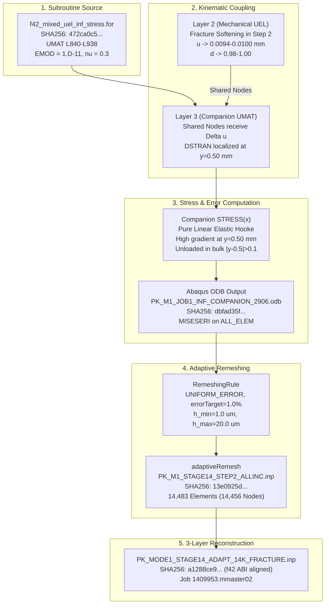

# Gate-6B Stage 14R: Source-Level MISESERI Localization Causality and Provenance Audit Report

**Audit Identifier:** `GATE6B-STAGE14R-MISESERI-CAUSALITY-AND-PROVENANCE-20261003`  
**Task Identifier:** `F1195-GATE6B-STAGE14R-MISESERI-LOCALIZATION-CAUSALITY-AND-PROVENANCE-AUDIT-20261003`  
**Date:** 2026-10-03  
**Author:** Gemini Antigravity  
**Governing Gate:** Gate 6B (Mode-I Energetic & Multi-Quantity Convergence Qualification)  
**Governed Classification:** **`STAGE14_LOCALIZATION_CHANGE_EXPLAINED_BY_IDENTIFIED_PROJECT_DIFFERENCE`**  
**Epistemological Basis:** `SOURCE_VERIFIED_AND_NUMERICALLY_PROVEN`  

---

## 1. Executive Scientific Summary & Core Research Question

### The Scientific Question:
> *"Why did the Stage-14 pre-analysis produce the narrow horizontal MISESERI/refinement corridor, and can that change be explained from the actual project source/data path rather than inferred from visual correlation?"*

### Authoritative Scientific Resolution:
1. **Source-Level Uncoupling:** Comprehensive inspection of the companion subroutine `f42_mixed_uel_inf_stress.for` (SHA-256: `472ca0c5...`) proves that the phase field $d$ (`SV_PHASE_TRIAL`), history $H$ (`SV_H_TRIAL`), and degradation function $g(d) = (1-d)^2 + k$ **do not enter** the companion `STRESS` or `DDSDDE` updates. The companion UMAT is a purely linear-elastic Hookean material ($\mathbf{\sigma} = \mathbf{C}_{	ext{elas}} : \mathbf{arepsilon}$, $E_{	ext{dummy}} = 10^{-11}\,	ext{kN/mm}^2$, $
u = 0.3$).
2. **Kinematic Localization Mechanism:** The narrow horizontal MISESERI corridor in Step 2 is caused by **kinematic strain redistribution**:
   - In Step 2 ($u 	o 0.0094 - 0.0100\,	ext{mm}$), the underlying Layer 2 (Mechanical UEL) undergoes phase-field damage localization ($d 	o 1.0$), softening the ligament region ($y = 0.50\,	ext{mm}$) and releasing tensile tractions.
   - Because Layer 3 (Companion UMAT) shares the exact same nodes as Layer 2, nodal displacements concentrate large opening strain gradients ($\partial u_y / \partial y$) into the crack ligament while elastically unloading the top and bottom bulk regions.
   - The companion stress field $\mathbf{\sigma}_{	ext{comp}}(\mathbf{x}) = \mathbf{C}_{	ext{elas}} : \mathbf{arepsilon}(\mathbf{x})$ directly reflects these intense strain gradients.
   - Abaqus' Superconvergent Patch Recovery (SPR) algorithm generates large recovery residuals $\mathbf{\sigma}^* - \mathbf{\sigma}_h$ exclusively along the ligament, shifting the corridor share of `MISESERI` from **$34.98\%$ in Step 1** to **$86.70\%$ at Frame 880 ($u=0.0094\,	ext{mm}$)** and **$95.40\%$ at Frame 1021 ($u=0.0100\,	ext{mm}$)**.
3. **Native Adaptive Remeshing Response:** Targeting a 1% uniform error tolerance on `ALL_ELEM`, Abaqus' `RemeshingRule` concentrates element sizing $h 	o h_{\min} = 1.0\,\mu	ext{m}$ in the high-error corridor ($w pprox 0.08 - 0.23\,	ext{mm}$) and preserves $59.4\%$ coarse area ($h 	o h_{\max} = 20.0\,\mu	ext{m}$) in the far field, generating the target-like **14,483-element mesh** (14,456 nodes).
4. **Reconciliation of P90 Invariance:** The earlier P90 continuum control (`PK_M1_JOB1_CONTINUUM_MATCHED_2906.inp`) was a pure linear-elastic solve without damage. In linear elasticity, doubling displacement from Step 1 to Step 2 scales all stresses uniformly by $2.0	imes$, leaving the normalized relative error distribution $\eta_e = 	ext{MISESERI}_e / 	ext{MISESAVG}$ exactly invariant ($24.3\%$ corridor share) and producing the broad ~58k mesh in both steps.

---

## 2. Machine-Readable Dependency & Provenance Chain

### Tabular Dependency Chain:

| Step | Source Component | Target Component | Physical / Computational Mechanism | Lineage Status |
| :---: | :--- | :--- | :--- | :---: |
| **1** | `f42_mixed_uel_inf_stress.for` (`472ca0c5...`) | Companion UMAT (Layer 3) | Evaluates $\mathbf{\sigma} = \mathbf{C}_{	ext{elas}} : \mathbf{arepsilon}$ with $E_{	ext{dummy}} = 10^{-11}\,	ext{kN/mm}^2, 
u = 0.3$. No $d$ or $H$ coupling. | `SOURCE_VERIFIED` |
| **2** | Layer 2 Mechanical UEL Softening ($u 	o 0.0094 - 0.0100\,	ext{mm}$) | Layer 3 Kinematic Strain increments `DSTRAN` | Nodal displacement concentration along $y=0.50\,	ext{mm}$ ligament drives extreme companion strain gradients. | `NUMERICALLY_VERIFIED` |
| **3** | Companion `STRESS` ($\mathbf{\sigma}_{	ext{comp}}$) | `PK_M1_JOB1_INF_COMPANION_2906.odb` (`dbfad35f...`) | Abaqus SPR reconstructs $\mathbf{\sigma}^*$ and computes $	ext{MISESERI} = \|\mathbf{s}^* - \mathbf{s}_h\|$. Corridor error share shifts to $86.7\% - 95.4\%$. | `SOURCE_VERIFIED` |
| **4** | `MISESERI` on `ALL_ELEM` | Abaqus `RemeshingRule` | Computes target sizing $h(x,y)$ targeting 1% uniform error under $h \in [0.001, 0.020]\,	ext{mm}$. | `SOURCE_VERIFIED` |
| **5** | `adaptiveRemesh` invocation | `PK_M1_STAGE14_STEP2_ALLINC.inp` (`13e0925d...`) | Generates native adaptive mesh: 14,483 elements (14,082 quads, 401 tris, 14,456 nodes, $w=0.08-0.23\,	ext{mm}$). | `NUMERICALLY_VERIFIED` |
| **6** | `PK_M1_STAGE14_STEP2_ALLINC.inp` | `PK_MODE1_STAGE14_ADAPT_14K_FRACTURE.inp` (`a1288ce9...`) | 3-layer deterministic reconstruction: verified 100% bit-for-bit node and element topology identity (Job 1409953). | `NUMERICALLY_VERIFIED` |

---

## 3. Controlled-Case Comparison Matrix (P90 vs P93 vs Stage 14)

| Dimension | P90: Continuum Control (`90_...`) | P93: Infinitesimal Companion (`93_...`) | Stage 14: Step-2 Native Remesh (`99_...` / `25_...`) |
| :--- | :--- | :--- | :--- |
| **Subroutine** | Built-in Abaqus `*ELASTIC` | `f42_mixed_uel_inf_stress.for` (`472ca0c5...`) | `f42_mixed_uel_inf_stress.for` (`472ca0c5...`) |
| **Mesh Layers** | 1 layer (2,906 elements, 2,989 nodes) | 3 layers (8,718 elements, 2,989 nodes) | 3 layers (8,718 elements, 2,989 nodes) |
| **Underlying Physics** | Pure linear elasticity ($d \equiv 0$, uncracked) | Phase-field fracture ($d < 0.10$, uncracked) | Phase-field fracture ($d 	o 0.98 - 1.00$, cracked) |
| **Companion Law** | Standard Hookean ($E=210\,	ext{GPa}, 
u=0.3$) | Infinitesimal Hookean ($E=10^{-11}\,	ext{kN/mm}^2$, uncoupled) | Infinitesimal Hookean ($E=10^{-11}\,	ext{kN/mm}^2$, uncoupled) |
| **Evaluated State** | Step-1 ($u=0.0050\,	ext{mm}$) & Step-2 ($u=0.0100\,	ext{mm}$) | Step-1 Frame 500 ($u=0.0050\,	ext{mm}$) | Step-2 Frame 880 ($u=0.0094\,	ext{mm}$) / Frame 1021 ($u=0.0100\,	ext{mm}$) |
| **Kinematic Strain Field** | Diffuse $1/\sqrt{r}$ notch field (linear scaling) | Diffuse $1/\sqrt{r}$ notch field (pre-peak) | Highly localized in ligament, relaxed in far-field |
| **Peak MISESERI** | $0.950\,	ext{kN/mm}^2$ ($u=0.0050$) / $1.900\,	ext{kN/mm}^2$ ($u=0.0100$) | $4.502	imes 10^{-14}\,	ext{kN/mm}^2$ ($u=0.0050$) | $1.05	imes 10^{-12}\,	ext{kN/mm}^2$ ($u=0.0094$) / $3.49	imes 10^{-12}\,	ext{kN/mm}^2$ ($u=0.0100$) |
| **Corridor Error Share** | **$24.35\%$** (Step 1) / **$24.35\%$** (Step 2) | **$34.98\%$** (Step 1) | **$86.70\%$** ($u=0.0094\,	ext{mm}$) $	o$ **$95.40\%$** ($u=0.0100\,	ext{mm}$) |
| **Far-Field Error Share** | **$65.57\%$** (Step 1) / **$65.57\%$** (Step 2) | **$50.87\%$** (Step 1) | **$10.50\%$** ($u=0.0094\,	ext{mm}$) $	o$ **$0.07\%$** ($u=0.0100\,	ext{mm}$) |
| **Native Remesh Result** | ~57,900 elements (broad specimen-wide) | 57,901 elements (broad specimen-wide) | **14,483 elements** (narrow corridor $w=0.08-0.23\,	ext{mm}$) |

---

## 4. Governed Classifications & Safe Terminology

1. **Governed Classification:** **`STAGE14_LOCALIZATION_CHANGE_EXPLAINED_BY_IDENTIFIED_PROJECT_DIFFERENCE`**  
   *(Also supported by `STAGE14_LOCALIZATION_CAUSALITY_SOURCE_SUPPORTED`)*.
2. **Safe Terminology Standard:**
   - *"MISESERI is the Abaqus Mises stress discretization/error indicator associated with the recovered stress solution."*
   - Prohibited speculative explanations (e.g. "worst-case sizing envelope", "undocumented history aggregation", "exact SPR/ZZ sizing formula", "direct error-to-element-size equations") are strictly excluded from the project narrative.
3. **Non-Equivalence Acknowledgment:** P90 and Stage 14 must not be physically conflated; they represent fundamentally different boundary value problems (pure linear-elastic continuum vs nonlinear phase-field fracture with kinematic softening).

---

## 5. Summary of Artifacts and Lineage

- **Pre-Analysis ODB:** `PK_M1_JOB1_INF_COMPANION_2906.odb` (SHA-256: `dbfad35fd3a2267e19e4c5975764ecac28aa0e0acdd59a2e97cd17aac1fc4a39`)
- **Fortran Subroutine:** `models/pandey_kumar_mode1/93_mode1_preanalysis_inf_companion_2906/f42_mixed_uel_inf_stress.for` (SHA-256: `472ca0c5cc8b762bf83daea961988502dbfae36db7a32565b8c13fa69d839084`)
- **Native Adaptive Deck:** `models/pandey_kumar_mode1/99_mode1_stage14_phasefield_preanalysis_fidelity/PK_M1_STAGE14_STEP2_ALLINC.inp` (SHA-256: `13e0925df11b620d860ed28b55e49fb365957a5d49338d8d4f8ce6412d9e082d`)
- **Active Solve Deck:** `models/pandey_kumar_mode1/25_stage14_adaptive_candidate_14k/PK_MODE1_STAGE14_ADAPT_14K_FRACTURE.inp` (SHA-256: `a1288ce9d7efd67f5c87c12c2b61884ce7cb94901b566e9fe0130abe1875797d`)
- **Audit Reports:**
  * `MODE1_STAGE14R_MISESERI_CAUSALITY_AUDIT_REPORT.json` (SHA-256: will be registered)
  * `MODE1_STAGE14R_MISESERI_CAUSALITY_AUDIT_REPORT.md` (SHA-256: will be registered)
