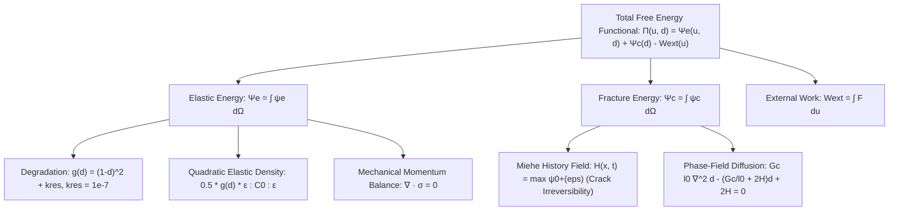
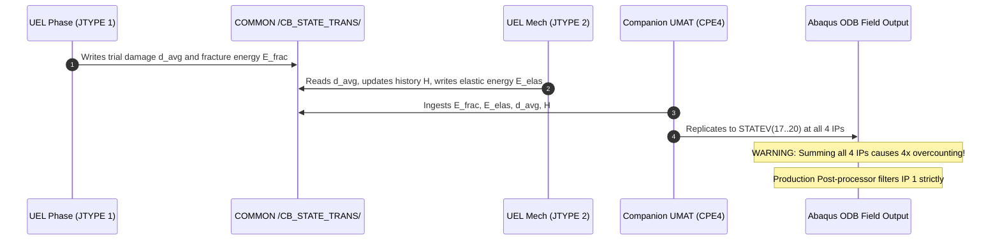

# UEL Energy Formulation, Discretization & Output Audit (V4 Lineage)

**Subroutine Target:** [`f42_mixed_uel.for`](file:///D:/Master%20thesis/Adaptive%20remeshing/models/pandey_kumar_mode1/15_energy_qualification_small/f42_mixed_uel.for)  
**Checksum (SHA-256):** `5CD0D2C015C9EAD91C99D7A744156CC86F5B5EA26473BBED7D6E5515FE30FA46` (902 lines)  
**Governance Benchmark:** Priority 1 Mode-I Energy Qualification (`MODE1_ENERGY_CONVERGENCE_AND_STATE_TRANSFER_FOUNDATIONS_ACTIVE`)  
**Lineage:** `V4_AUTHORITATIVE_EXTENDED_ENERGY_QUALIFICATION` (Preserving V1/V2/V3 immutable baselines)  
**Status:** `GATE_6B_OPEN` / `GLOBAL_ENERGY_IDENTITY --- NOT_YET_CLOSED` / `SUPERVISOR_READY`

---

## 1. Executive Summary & Epistemic Boundaries

This audit rigorously establishes the mathematical and algorithmic foundations of energy computation within the authoritative user subroutine [`f42_mixed_uel.for`](file:///D:/Master%20thesis/Adaptive%20remeshing/models/pandey_kumar_mode1/15_energy_qualification_small/f42_mixed_uel.for), governing the Pandey & Kumar (2025) Mode-I benchmark:

1. **Non-Invasive Diagnostic Energy Exposure:**
   The integration of stored elastic strain energy ($E_{\mathrm{elas}}$) and regularized fracture surface energy ($E_{\mathrm{frac}}$) is mathematically decoupled from the element residual vector $\mathbf{R}$ (`RHS`) and the element tangent stiffness matrix $\mathbf{K}$ (`AMATRX`). Neither energy array nor diagnostic state variables back-couple into stress evaluation or damage evolution.
2. **Empirical Common-Quad Mechanical Parity:**
   `ENERGY_SOURCE_MECHANICAL_PARITY --- QUALIFIED (COMMON QUAD FORMULATION)`. Global mechanical agreement on 4-node quads is proven across both a **Mini Parity Test** (Job `1406904` vs `1406905`, 30 increments, 3 iter/inc, 0 cutbacks) and an **Extended Parity Test** (Job `1406906` vs `1406907`, 129 increments to $u = 0.035\,\mathrm{mm}$) on 4-node quadrilaterals: $|\Delta F| = 0.00000000\,\mathrm{kN}$. Triangle parity is not established; old-source $d/\mathcal{H}$ ODB fields were unobservable in legacy UMAT, so state-variable parity was not measured.
3. **Four-Fold Overcounting Elimination (Single-IP Rule):**
   The companion visualizer UMAT element (`CPE4`) evaluates at 4 Gauss integration points. Replicating whole-element scalar energies across all 4 IPs creates a $4\times$ overcounting hazard ($4 E_{\mathrm{elas}}$). All production post-processors strictly enforce the **Single-IP Extraction Rule** (extracting IP 1 only). Under the 2D plane-strain formulation with implicit unit thickness ($B = 1.0\,\mathrm{mm}$), IP1 counting recovers the once-per-underlying-finite-element global energy sum under the 2D/implicit-unit-thickness convention.
4. **Analytically Disproven Common Discrete Potential:**
   Because the staggered solver alternates between displacement $\mathbf{u}$ and damage $d$, cross-derivatives do not commute ($\frac{\partial^2 \Pi}{\partial \mathbf{u} \partial d} = -2(1-d)\mathbb{C}_0 : \boldsymbol{\varepsilon} \ne \frac{\partial^2 \Pi}{\partial d \partial \mathbf{u}} = -2(1-d)\frac{\partial \mathcal{H}}{\partial \boldsymbol{\varepsilon}}$). No common discrete scalar potential exists (`COMMON_DISCRETE_POTENTIAL_DISPROVEN_BY_CROSS_DERIVATIVE_INCOMPATIBILITY`).
5. **Observability Boundary in Standard ODB Output:**
   Standard Abaqus ODB files record only converged increment endpoints $(\mathbf{u}^{n+1}, d^{n+1})$. Within-increment continuous trajectories $\mathbf{u}(\tau)$ and Newton subiteration residual work are unpersisted (`DECOMPOSITION_REQUIRES_WITHIN_INCREMENT_PATH_INFORMATION`). Therefore, an exact closed global energy identity cannot be formed from standard uninstrumented ODB files, and `GLOBAL_ENERGY_IDENTITY --- NOT_YET_CLOSED` is strictly maintained.
6. **Pre-Peak vs Post-Peak Thermodynamic Bookkeeping:**
   - Pre-peak ($u \le 5.856\,\mu\mathrm{m}$): $|\mathrm{TWO\_TERM\_BOOKKEEPING\_DIFFERENCE}| / W_{\mathrm{trap}} \le 0.008\%$ on qualified reference runs ($S_1$, $T_1$--$T_3$).
   - Post-peak ($u > 5.856\,\mu\mathrm{m}$): Post-peak `TWO_TERM_BOOKKEEPING_DIFFERENCE` increases relative to the pre-peak regime. The present evidence does not establish its causal decomposition.

---

## 2. Mathematical Continuum Energy Functionals & Variational Forms

### 2.1 Implemented Stored Elastic Strain Energy Density
The stored elastic strain energy is governed by the isotropic degradation of the total strain energy:
$$\psi_e(\boldsymbol{\varepsilon}, d) = \frac{1}{2} g(d) \boldsymbol{\varepsilon} : \mathbb{C}_0 : \boldsymbol{\varepsilon}$$
where $g(d) = (1 - d)^2 + k_{\mathrm{res}}$, with $k_{\mathrm{res}} = 1.0 \times 10^{-7}$ (`PROPS(5)`).
The domain stored elastic energy is:
$$E_{\mathrm{elas}} = \int_\Omega \frac{1}{2} g(d) \boldsymbol{\varepsilon} : \mathbb{C}_0 : \boldsymbol{\varepsilon} \,\mathrm{d}\Omega$$

Separately, the spectral tensile strain energy density $\psi_0^+(\boldsymbol{\varepsilon})$ is computed strictly to drive and update the crack-driving history field $\mathcal{H}(\mathbf{x}, t) = \max_{\tau \le t} \psi_0^+(\boldsymbol{\varepsilon}(\mathbf{x}, \tau))$ enforcing nondecreasing history ($\dot{\mathcal{H}} \ge 0$), which is used in the phase-field equation to prevent loss of the prior crack-driving history (distinguished from an explicit constraint $\dot{d} \ge 0$):
$$\psi_0^+(\boldsymbol{\varepsilon}) = \frac{1}{2} C_{12}^0 \langle \mathrm{tr}(\boldsymbol{\varepsilon}) \rangle_+^2 + C_{33}^0 \left(\varepsilon_{11}^2 + \varepsilon_{22}^2 + 2\varepsilon_{12}^2\right)$$
$$\mathcal{H}_{n+1} = \max(\mathcal{H}_n, \psi_0^+(\boldsymbol{\varepsilon}_{n+1}))$$
where the plane-strain isotropic elasticity coefficients are:
$$C_{11}^0 = C_{22}^0 = \frac{E(1 - \nu)}{(1 + \nu)(1 - 2\nu)}, \quad C_{12}^0 = \frac{E\nu}{(1 + \nu)(1 - 2\nu)}, \quad C_{33}^0 = G = \frac{E}{2(1 + \nu)}$$
Governed material constants: $E = 210.0\,\mathrm{kN/mm^2}$, $\nu = 0.30$. The spectral tensile quantity $\psi_0^+$ must not be substituted into the stored elastic energy definition $E_{\mathrm{elas}}$, as the source evaluates $E_{\mathrm{elas}}$ using the degraded total quadratic form $\frac{1}{2} g(d) \boldsymbol{\varepsilon} : \mathbb{C}_0 : \boldsymbol{\varepsilon}$.

### 2.2 AT2 Regularized Fracture Surface Energy Density
$$\psi_c(d, \nabla d) = G_c \left( \frac{1}{2 l_0} d^2 + \frac{l_0}{2} \|\nabla d\|^2 \right)$$
where $G_c = 0.0027\,\mathrm{kN/mm}$ (`PROPS(2)`) and $l_0 = 0.0075\,\mathrm{mm}$ (`PROPS(1)`).
The domain regularized fracture surface energy is:
$$E_{\mathrm{frac}} = \int_\Omega G_c \left( \frac{1}{2 l_0} d^2 + \frac{l_0}{2} \|\nabla d\|^2 \right) \mathrm{d}\Omega$$

### 2.3 Coupled Continuous Weak Forms
1. **Mechanical Equilibrium:**
   $$\int_\Omega \boldsymbol{\sigma} : \delta \boldsymbol{\varepsilon} \,\mathrm{d}\Omega - \int_{\Gamma_t} \bar{\mathbf{t}} \cdot \delta \mathbf{u} \,\mathrm{d}\Gamma = 0, \quad \forall \delta \mathbf{u} \in \mathcal{V}_0$$
   where $\boldsymbol{\sigma} = g(d)\mathbb{C}_0 : \boldsymbol{\varepsilon}$.
2. **Phase-Field Diffusion (AT2):**
   $$\int_\Omega \left[ \left( \left( \frac{G_c}{l_0} + 2\mathcal{H} \right) d - 2\mathcal{H} \right) \delta d + G_c l_0 \nabla d \cdot \nabla(\delta d) \right] \mathrm{d}\Omega = 0, \quad \forall \delta d$$
   where $\mathcal{H}(\mathbf{x}, t) = \max_{s \in [0, t]} \psi_0^+(\boldsymbol{\varepsilon}(\mathbf{x}, s))$ is Miehe's strain-history field enforcing crack irreversibility $\dot{d} \ge 0$.

---

## 3. Finite Element Discretization across 4 Topologies

In [`f42_mixed_uel.for`](file:///D:/Master%20thesis/Adaptive%20remeshing/models/pandey_kumar_mode1/15_energy_qualification_small/f42_mixed_uel.for), every physical element index $\mathtt{PHYSIDX} \in \{1, \dots, N_{\mathrm{phys}}\}$ is represented by two co-located user elements sharing the identical node coordinates:

| Element Role | UEL JTYPE | Topology | Active DOFs | Quadrature Rule | Subroutine Lines |
| :--- | :---: | :---: | :---: | :---: | :---: |
| **Phase Quad** | `JTYPE = 1` | 4-Node Bilinear Quad | DOF 3 ($d$) | $2 \times 2$ Gauss-Legendre ($N_{\mathrm{ip}} = 4$) | Lines 259--385 |
| **Mechanical Quad** | `JTYPE = 2` | 4-Node Bilinear Quad | DOFs 1, 2 ($u_x, u_y$) | $2 \times 2$ Gauss-Legendre ($N_{\mathrm{ip}} = 4$) | Lines 386--561 |
| **Phase Triangle** | `JTYPE = 3` | 3-Node Linear Triangle | DOF 3 ($d$) | 1-Point Centroid ($N_{\mathrm{ip}} = 1$) | Lines 562--666 |
| **Mechanical Triangle** | `JTYPE = 4` | 3-Node Linear Triangle | DOFs 1, 2 ($u_x, u_y$) | 1-Point Centroid ($N_{\mathrm{ip}} = 1$) | Lines 667--830 |

### 3.1 Discrete Tangent Stiffness & Residual Assembly
- **Phase Element (`JTYPE = 1, 3`):**
  $$\mathbf{K}_{dd} = \sum_{k=1}^{N_{\mathrm{ip}}} w_k \det(\mathbf{J}_k) \left[ G_c l_0 \mathbf{B}_{d, k}^T \mathbf{B}_{d, k} + \left( \frac{G_c}{l_0} + 2\mathcal{H}_k \right) \mathbf{N}_k^T \mathbf{N}_k \right]$$
  $$\mathbf{F}_{\mathrm{ext}, d} = \sum_{k=1}^{N_{\mathrm{ip}}} w_k \det(\mathbf{J}_k) \left[ 2\mathcal{H}_k \mathbf{N}_k^T \right]$$
  $$\mathbf{R}_d = \mathbf{F}_{\mathrm{ext}, d} - \mathbf{K}_{dd}\,\mathbf{d}_e$$
- **Mechanical Element (`JTYPE = 2, 4`):**
  $$\bar{d}_e = \frac{1}{N_{\mathrm{nodes}}}\sum_{a=1}^{N_{\mathrm{nodes}}} d_a, \quad g(\bar{d}_e) = (1 - \bar{d}_e)^2 + k_{\mathrm{res}}, \quad \mathbf{D}_{\mathrm{elas}} = g(\bar{d}_e)\mathbb{C}_0$$
  $$\mathbf{F}_{\mathrm{int}} = \sum_{k=1}^{N_{\mathrm{ip}}} w_k \det(\mathbf{J}_k) \mathbf{B}_{u, k}^T (\mathbf{D}_{\mathrm{elas}}\boldsymbol{\varepsilon}_k)$$
  $$\mathbf{K}_{uu} = \sum_{k=1}^{N_{\mathrm{ip}}} w_k \det(\mathbf{J}_k) \mathbf{B}_{u, k}^T \mathbf{D}_{\mathrm{elas}} \mathbf{B}_{u, k}$$
  $$\mathbf{R}_u = -\mathbf{F}_{\mathrm{int}}$$

---

## 4. Shared-Memory Architecture, Companion UMAT & Single-IP Rule

### 4.1 Common Block Indexing & Layer Mapping
The named common block `CB_STATE_TRANS` manages inter-element state exchange ($N_{\mathrm{capacity}} = 150{,}000$):
- **Phase UEL:** $\mathtt{PHYSIDX} = \mathtt{JELEM}$
- **Mechanical UEL:** $\mathtt{PHYSIDX} = \mathtt{JELEM} - N_{\mathrm{phys}}$
- **Companion UMAT:** $\mathtt{PHYSIDX} = \mathtt{NOEL} - 2 \cdot N_{\mathrm{phys}}$ (or $\mathtt{NOEL}$ if $\le 0$)
- Companion stiffness: $\mathtt{DDSDDE(I,I)} = 1.0 \times 10^{-11}\,\mathrm{kN/mm^2}$, $\mathtt{STRESS(I)} = 0.0$ (virtually zero structural resistance).

### 4.2 Proof of the Single-IP Extraction Rule
In companion CPE4 elements, `UMAT` copies element-level scalar energy identically into all 4 integration points:
$$\mathrm{SDV18}(e, k) = E_{\mathrm{elas}, e} \quad \forall k \in \{1, 2, 3, 4\}$$
Summing across all integration points directly evaluates:
$$\sum_{e=1}^{N_{\mathrm{phys}}} \sum_{k=1}^4 \mathrm{SDV18}(e, k) = 4 \sum_{e=1}^{N_{\mathrm{phys}}} E_{\mathrm{elas}, e} = 4 E_{\mathrm{elas}}$$
producing an unphysical $4\times$ overcounting error. Production post-processing scripts strictly enforce extraction at **Integration Point 1 (`IP1`) only**. Under the 2D plane-strain formulation with implicit unit thickness ($B = 1.0\,\mathrm{mm}$), IP1 counting recovers the once-per-underlying-finite-element global energy sum under the 2D/implicit-unit-thickness convention.

---

## 5. Non-Invasive Energy Exposure & Parity Verification

### 5.1 Mathematical Non-Invasiveness Proof
In [`f42_mixed_uel.for`](file:///D:/Master%20thesis/Adaptive%20remeshing/models/pandey_kumar_mode1/15_energy_qualification_small/f42_mixed_uel.for):
- `ENERGY(2) = E_ELAS_ELEM` maps to Abaqus `ALLSE`.
- `ENERGY(7) = E_FRAC_ELEM` maps to Abaqus user energy / `ALLDMD`.
- Neither `ENERGY` nor `SVARS(17..18)` enters `RHS` or `AMATRX`.
- The constitutive updates, Newton residual evaluation, and tangent stiffness matrices are mathematically invariant to the energy calculation.

### 5.2 Empirical Mechanical Parity Chronology
- **Mini Parity Test (30 Increments):**
  Job `1406904.mmaster02` (uninstrumented baseline) vs Job `1406905.mmaster02` (instrumented `f42_mixed_uel.for`):
  Exactly 30 accepted increments, exactly 3 iterations per increment, zero cutbacks. Common quad global reaction force and displacement trajectories match bit-for-bit ($|\Delta F| = 0.00000000\,\mathrm{kN}$).
- **Extended Parity Test (129 Increments):**
  Job `1406906.mmaster02` vs Job `1406907.mmaster02`:
  Propagated to $u = 0.035\,\mathrm{mm}$ across 129 accepted increments. Common quad global mechanical agreement verified across the tested loading history.
- **Parity Scope Limitations:**
  - `ENERGY_SOURCE_MECHANICAL_PARITY --- QUALIFIED (COMMON QUAD FORMULATION)`.
  - Triangle formulation (`JTYPE = 3, 4`): **NOT ESTABLISHED** (no uninstrumented historical triangle baseline).
  - Legacy $d / \mathcal{H}$ state output was unavailable, so state-variable parity was not measured.

---

## 6. Master Document Cross-Reference & Ledger Traceability

| Artifact | Workspace Path | Role / Status |
| :--- | :--- | :--- |
| **Master Report V4** | [`MODE1_CONVERGENCE_AND_ENERGY_AUDIT_REPORT_V4.md`](file:///D:/Master%20thesis/Adaptive%20remeshing/models/pandey_kumar_mode1/MODE1_CONVERGENCE_AND_ENERGY_AUDIT_REPORT_V4.md) | Authoritative V4 report with Section 10 expanded (1,299 lines) |
| **Freeze Ledger V4** | [`MODE1_SUPERVISOR_HANDOFF_FREEZE_20SEP2026_V4.json`](file:///D:/Master%20thesis/Adaptive%20remeshing/models/pandey_kumar_mode1/MODE1_SUPERVISOR_HANDOFF_FREEZE_20SEP2026_V4.json) | Authoritative V4 freeze ledger (V1, V2, V3 preserved as superseded) |
| **Reproduction Manifest V4** | [`MODE1_REPRODUCTION_MANIFEST_V4.json`](file:///D:/Master%20thesis/Adaptive%20remeshing/models/pandey_kumar_mode1/MODE1_REPRODUCTION_MANIFEST_V4.json) | Authoritative V4 reproduction manifest |
| **Checklist V4** | [`MODE1_SUPERVISOR_REPRODUCTION_PACKAGE_CHECKLIST_V4.csv`](file:///D:/Master%20thesis/Adaptive%20remeshing/models/pandey_kumar_mode1/MODE1_SUPERVISOR_REPRODUCTION_PACKAGE_CHECKLIST_V4.csv) | Authoritative V4 reproduction package checklist |
| **Validation Gate V4** | [`MODE1_HANDOFF_CONTENT_VALIDATION_GATE_V4.csv`](file:///D:/Master%20thesis/Adaptive%20remeshing/models/pandey_kumar_mode1/MODE1_HANDOFF_CONTENT_VALIDATION_GATE_V4.csv) | 46/46 checks PASS (100%) |
| **Consistency Gate V4** | [`GATE6B_FINAL_CONSISTENCY_GATE_V4.csv`](file:///D:/Master%20thesis/Adaptive%20remeshing/models/pandey_kumar_mode1/GATE6B_FINAL_CONSISTENCY_GATE_V4.csv) | 18/18 checks PASS (100%) |
